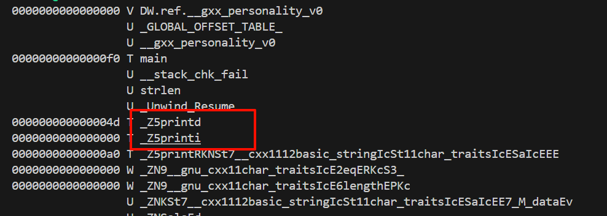
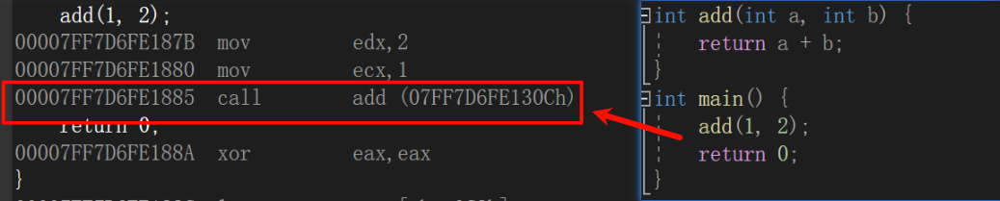
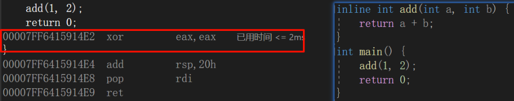

- [C++ 基础特性](#c-基础特性)
  - [命名空间](#命名空间)
    - [命名空间的定义](#命名空间的定义)
    - [使用命名空间](#使用命名空间)
    - [嵌套命名空间](#嵌套命名空间)
    - [匿名命名空间（Unnamed Namespace）](#匿名命名空间unnamed-namespace)
      - [**匿名命名空间的定义**](#匿名命名空间的定义)
      - [匿名命名空间的作用](#匿名命名空间的作用)
      - [**匿名命名空间的特点**](#匿名命名空间的特点)
  - [输入输出](#输入输出)
    - [标准输入和输出流](#标准输入和输出流)
  - [缺省参数](#缺省参数)
    - [缺省参数的规则](#缺省参数的规则)
  - [函数重载](#函数重载)
    - [函数重载的基本概念](#函数重载的基本概念)
    - [**函数重载的规则**](#函数重载的规则)
    - [如何实现函数重载](#如何实现函数重载)
    - [C语言为什么不支持函数重载](#c语言为什么不支持函数重载)
    - [`extern "C"`关键字](#extern-c关键字)
  - [引用](#引用)
    - [引用特性](#引用特性)
    - [使用场景](#使用场景)
    - [传值、传引用效率比较](#传值传引用效率比较)
    - [引用和指针的区别](#引用和指针的区别)
  - [内联函数](#内联函数)
    - [内联函数的使用方法](#内联函数的使用方法)
    - [查看方式](#查看方式)
    - [什么时候使用内联函数：](#什么时候使用内联函数)
    - [内联函数和宏](#内联函数和宏)
  - [`auto`关键字](#auto关键字)
    - [**基本用法**](#基本用法)
    - [auto与指针和引用](#auto与指针和引用)
    - [用于迭代器](#用于迭代器)
    - [返回类型推导(C++14)](#返回类型推导c14)
  - [基于范围的for](#基于范围的for)
    - [**基本语法**](#基本语法)
  - [空指针`nullptr`(C++11)](#空指针nullptrc11)

# C++ 基础特性

## 命名空间

> 命名空间（namespace）是C++中用于组织代码的机制，防止不同部分的代码出现命名冲突。使用命名空间的目的是对标识符的名称进行本地化，以避免命名冲突或名字污染。

### 命名空间的定义

命名空间通过`namespace`关键字定义。可以将多个类、函数、变量等放入同一个命名空间内。命名空间的定义方式如下：

```cpp
namespace MyNamespace {
    int var = 10;  // 变量
    void myFunction() {  // 函数
        std::cout << "Hello from MyNamespace!" << std::endl;
    }
    class MyClass {  // 类
    public:
        void display() {
            std::cout << "This is MyClass." << std::endl;
        }
    };
}

```

在这个例子中，我们定义了一个命名空间`MyNamespace`，其中包含了一个整型变量`var`、一个函数`myFunction`，以及一个类`MyClass`。

### 使用命名空间

访问命名空间中的成员时，需要使用`::`操作符（作用域解析运算符），明确指出成员属于哪个命名空间。例如：

```cpp
int main() {
    MyNamespace::myFunction();  // 调用命名空间中的函数
    std::cout << MyNamespace::var << std::endl;  // 访问命名空间中的变量
    
    MyNamespace::MyClass obj;  // 创建命名空间中的类对象
    obj.display();
    
    return 0;
}
```

**使用`using`简化代码**

在程序中频繁访问某个命名空间的成员，可以使用`using`关键字来避免每次都写`命名空间::成员`。例如：

```cpp
using namespace MyNamespace;  // 引入整个命名空间

int main() {
    myFunction();  // 无需写 MyNamespace::myFunction
    std::cout << var << std::endl;  // 无需写 MyNamespace::var
    
    MyClass obj;  // 无需写 MyNamespace::MyClass
    obj.display();
    
    return 0;
}
```

注意：也可以只使用using将命名空间中**成员**引入

```cpp
using namespace MyNamespace::myFunction		 //引入命名空间中的成员
```

### 嵌套命名空间

命名空间也可以嵌套，即一个命名空间内包含另一个命名空间。定义方法如下：

```cpp
namespace OuterNamespace {
    namespace InnerNamespace {
        void myFunction() {
            std::cout << "Hello from InnerNamespace!" << std::endl;
        }
    }
}
```

在访问时，可以用`::`逐层指明命名空间：

```cpp
int main() {
    OuterNamespace::InnerNamespace::myFunction();
    return 0;
}
```

### 匿名命名空间（Unnamed Namespace）

> 匿名命名空间是没有名字的命名空间，它的作用范围仅限于定义它的源文件。匿名命名空间通过`namespace {}`定义，而不指定命名空间的名字。它的主要特点是封装在该命名空间中的所有符号（如变量、函数、类等）只能在当前文件中使用，外部无法访问。这使得匿名命名空间非常适合用于防止命名冲突以及隐藏实现细节

####  **匿名命名空间的定义**

匿名命名空间的定义方式如下：

```cpp
namespace {
    int secretVar = 42;  // 只在当前文件中可见
    void secretFunction() {
        std::cout << "This is a secret function." << std::endl;
    }
}
```

在这个例子中，`secretVar`和`secretFunction`都被定义在匿名命名空间中，因此它们只能在当前文件内使用，无法在其他文件中访问。

#### 匿名命名空间的作用

匿名命名空间的作用主要是**避免命名冲突**和**隐藏实现细节**。

- **避免命名冲突**：当在一个大项目中与其他代码进行合并时，多个文件中可能会定义同名的函数或变量。通过使用匿名命名空间，可以确保这些同名的函数或变量在文件间不会发生冲突，因为它们的作用范围被限制在了定义它们的源文件中。
- **隐藏实现细节**：匿名命名空间用于封装和隐藏实现的细节，使它们不暴露给其他文件。这样，其他文件就无法访问这些细节，从而避免不必要的依赖。

####  **匿名命名空间的特点**

1. **仅在当前文件有效**： 匿名命名空间中的符号（变量、函数等）只在定义它的源文件中有效，外部文件无法访问。
2. **每个文件都有独立的匿名命名空间**： 匿名命名空间在不同的源文件中是独立的，即使不同文件中都有相同的匿名命名空间，它们互不影响。每个文件中都有一个唯一的匿名命名空间。
3. **符号名称限定**： 匿名命名空间中的符号的名称不需要担心与其他文件中的符号冲突，因为匿名命名空间内部符号的名称不会暴露到外部。

## 输入输出

> C++ 的输入输出（I/O）机制通过标准库提供的流对象进行管理。输入和输出操作是通过流（stream）来处理的，流可以是输入流（如读取文件或从键盘输入）和输出流（如将数据写入屏幕或文件）。

### 标准输入和输出流

在 C++ 中，标准输入流、标准输出流分别通过以下对象进行表示：

- **`std::cin`**：标准输入流，用于从键盘读取数据。
- **`std::cout`**：标准输出流，用于将数据输出到控制台（屏幕）。

使用C++输入输出更方便，不需增加数据格式控制，比如：整形--%d，字符--%c

```cpp
#include <iostream>

int main() {
    int age;
    double height;
    
    std::cin >> age;  // 从键盘输入整数
    std::cin >> height;  // 从键盘输入浮点数
    
    std::cout << age <<  height << std::endl;
    return 0;
}
```

## 缺省参数

> 缺省参数（也叫默认参数）是 C++ 中的一项功能，它允许在函数声明时为某些参数指定默认值。如果在调用函数时没有传递这些参数，则使用默认值。缺省参数可以使得函数调用更加简洁，减少代码重复。

```cpp
#include <iostream>

void greet(std::string name = "Guest", int age = 18) {
    std::cout << "Hello, " << name << ". You are " << age << " years old." << std::endl;
}

int main() {
    greet();  // 使用缺省值：name = "Guest", age = 18
    greet("Alice");  // 使用缺省值：age = 18
    greet("Bob", 25);  // 不使用缺省值
    return 0;
}
```

### 缺省参数的规则

*  **缺省参数必须从右到左提供**： 如果函数有多个参数，并且你希望给某些参数提供缺省值，那么必须从**最右侧的参数开始**给出缺省值。即不能跳过中间的参数，仅为某些参数提供缺省值。
*  **缺省参数可以在函数声明中指定，也可以在定义中指定**：
   - 如果在声明中给出了缺省参数，定义中就不需要再重复提供。
   - 如果没有在声明中提供缺省参数，必须在定义中提供默认值。
*  **缺省值必须是常量或者全局变量**

## 函数重载

> **函数重载**是 C++ 中的一种特性，它允许在同一个作用域中定义多个同名的函数，只要它们的参数列表（参数的数量或类型）不同。函数重载提供了根据不同的输入调用同一个函数名称的能力，从而使代码更加简洁和可读。

### 函数重载的基本概念

函数重载允许在同一个作用域中定义多个函数，这些函数具有相同的名称，但它们的参数列表不同。编译器会根据函数调用时传递的参数来决定调用哪个函数。

```cpp
#include <iostream>

void print(int i) {
    std::cout << "Integer: " << i << std::endl;
}

void print(double d) {
    std::cout << "Double: " << d << std::endl;
}

void print(const std::string& str) {
    std::cout << "String: " << str << std::endl;
}

int main() {
    print(10);         // 调用 print(int)
    print(3.14);       // 调用 print(double)
    print("Hello");    // 调用 print(string)
    return 0;
}
```

在这个例子中，`print` 函数被重载了三次：一个接受整数、一个接受浮点数、一个接受字符串。根据传递的参数类型，编译器会选择适当的重载版本。

###  **函数重载的规则**

C++ 中函数重载的规则：

- **参数数量不同**：如果函数参数的数量不同，编译器可以根据参数的个数来决定使用哪个重载。
- **参数类型不同**：如果函数参数的类型不同，编译器可以根据参数类型来选择适当的重载。
- **参数顺序不同**：如果函数参数的类型相同，但顺序不同，也可以进行重载。
- **返回类型不能作为重载的区分依据**：C++ **不允许仅通过返回类型不同**来重载函数，函数的返回类型不能作为重载的依据

### 如何实现函数重载

> 函数重载是由 C++ 编译器在编译时通过名称修饰（Name Mangling）来实现的。编译器会在内部对函数的名称进行修改，以便能够区分不同的重载版本。

为了了解编译器是如何处理这些重载函数的，我们反编译下上面函数重载示例的代码，看下汇编代码。

由于Windows下vs的修饰规则过于复杂，而Linux下g++的修饰规则简单易懂，下面使用了g++演示这个修饰后的名字。

> 名称修饰是 C++ 编译器对函数名称进行修改的过程，它会将函数的名称与其参数的类型信息结合起来，生成一个唯一的标识符。这样即使多个函数有相同的名称，编译器仍然能够区分它们。

1. **编译 C++ 程序**

先将 C++ 源代码编译成目标文件：

```bash
g++ -c overload.cpp
```

这将生成 `overload.o`

2. **查看名称修饰**

使用 `nm` 命令查看目标文件中的符号表，显示修饰后的函数名称：

```bash
nm overload.o
```

会看到以下内容



可以发现编译之后，**重载函数的名字变了不再都是print**！这样不存在命名冲突的问题了。

但又有新的问题了——变名机制是怎样的，即如何将一个重载函数的签名映射到一个新的标识？

第一反应是：**函数名**+**参数列表**，因为函数重载取决于参数的类型、个数，而跟返回类型无关。

具体解释如下：

- `_Z` 是 GCC 中的前缀，表示这是一个 C++ 名称修饰符。
- `5` 是函数名 `print` 的长度。
- `print` 是函数的名称。
- `d` 表示参数的类型（`d` 代表 `double`）

总结：：在linux下，采用g++编译完成后，函数名字的修饰发生改变，编译器将函数参数类型信息添加到修改后的名字中。

详细解释见[C++的函数重载 ](https://www.cnblogs.com/skynet/archive/2010/09/05/1818636.html)

### C语言为什么不支持函数重载

在 C 语言中，函数的调用是通过其符号名称来确定的。链接器通过**函数的名称**查找符号表，并将正确的函数与调用代码链接起来。

如果按照gcc编译上述文件会得到


结论：在linux下，采用gcc编译完成后，函数名字的修饰没有发生改变。故无法支持函数重载、

### `extern "C"`关键字

在 C++ 中，可以使用 `extern "C"` 关键字将函数按照 C 语言的方式来编译，这样 C++ 编译器就会使用 C 的名称修饰规则（也叫名称链接规范）。这可以确保 C++ 编译器不会对函数名称进行 C++ 的名称修饰，而是按照 C 语言的标准方式处理函数。

主要用于：

- **与 C 代码互操作**：例如，当 C++ 代码需要调用 C 库或者将 C++ 函数暴露给 C 代码时。
- **避免名称修饰**：C++ 会对函数名进行名称修饰（mangling），使用 `extern "C"` 可以让函数按照 C 的方式进行链接，保持函数名不变

使用 `extern "C"` 来声明和定义函数：

```cpp
extern "C" {
    void foo(int a);
}
```

**总结**：C++ 可以通过 `extern "C"` 关键字将函数按照 C 的方式来编译和链接。`extern "C"` 会禁用 C++ 的名称修饰，并允许 C++代码与 C 代码进行兼容和互操作。

## 引用

> 引用是一个别名，它是某个变量的直接引用。在声明时，引用必须与一个已有的变量绑定，并且一旦绑定后就不能再改变指向其他对象。

语法：

```cpp
type& reference_name = existing_variable;
```

- `type`：引用所绑定的变量类型。
- `&`：表示引用的符号。
- `reference_name`：引用变量的名字。
- `existing_variable`：要引用的现有变量。

### 引用特性

- 引用在**定义时必须初始化**
- 一个变量可以有多个引用
- 引用一旦引用一个实体后，不能再引用其他实体

### 使用场景

**传递引用作为参数**

通过引用传递参数，函数可以直接操作原始数据，而不是它的副本，这样不仅提高了效率，还可以使函数修改调用者的变量。

```cpp
void increment(int& num) {
    num += 1;  // 直接修改调用者的变量
}

int main() {
    int x = 5;
    increment(x);  // x 被修改为 6
    std::cout << x;  // 输出 6
}
```

 **传递常量引用**

常量引用（`const` 引用）允许通过引用传递参数，但保证不会修改传入的对象。这对传递大的对象（如大数组或大类对象）很有用，因为常量引用避免了不必要的复制，同时保持对象不变。

```cpp
void print(const std::string& str) {
    std::cout << str << std::endl;
}

int main() {
    std::string text = "Hello, World!";
    print(text);  // 通过引用传递，避免复制
}
```

**引用作为函数返回值**

引用可以作为函数的返回值，这样函数可以返回一个对象的别名，避免了复制操作。但是要注意返回的引用应该指向有效的对象，否则会导致未定义的行为。

```cpp
int& getElement(int* arr, int index) {
    return arr[index];  // 返回数组元素的引用
}

int main() {
    int arr[] = {10, 20, 30};
    int& ref = getElement(arr, 1);
    ref = 40;  // 修改 arr[1] 的值为 40
    std::cout << arr[1];  // 输出 40
}
```

**返回局部变量的引用是一个常见的错误**，容易导致未定义行为。因为局部变量在函数结束时会被销毁，如果返回该变量的引用，那么返回的引用将指向一个已经被销毁的内存区域。

错误示例：

```cpp
int& badFunction() {
    int localVar = 10;
    return localVar;  // 错误，返回一个局部变量的引用
}

int main() {
    int& ref = badFunction();  // 引用指向已销毁的变量
    std::cout << ref;  // 未定义行为，可能会出现一个随机值
}
```

**为什么不行？**

- `localVar` 是 `badFunction` 函数的局部变量，它的生命周期只在函数内部有效。
- 当 `badFunction` 返回时，`localVar` 会被销毁，因此返回的引用指向一个已经无效的内存区域（悬空引用）。

**正确做法**：

如果你需要返回一个引用，确保返回的是一个静态存储区的对象（例如，全局变量、静态变量或者堆上的对象）。

**总结**：**避免返回局部变量的引用**：局部变量在函数退出时会被销毁，返回局部变量的引用是危险的。

### 传值、传引用效率比较

**传值**

> 传值是将函数参数的副本传递给函数。这意味着函数内部对参数的修改不会影响外部传入的值。

**传值的特点**：

- **内存开销**：当传递的参数较大（如大数组、大对象）时，传值会创建该对象的副本，这会占用额外的内存。拷贝的过程可能会消耗较多的时间，尤其是当对象较大时。
- **开销：** 传值时需要进行 **拷贝构造** 或 **移动构造**。如果拷贝构造函数比较复杂，传值就会比较慢，尤其是涉及大数据结构时。
- **修改局限**：由于传值只是传递副本，函数内部对参数的修改不会影响原始数据。

**传引用**

> 传引用是将参数的引用传递给函数，函数内部操作的就是原始对象而非副本。因此，传引用的方式通常比传值更高效，尤其是在传递大型对象时。

**传引用的特点**：

- **内存开销**：传引用时，只传递一个指向原始对象的指针（引用实际上是一个隐式的指针）。这样不需要额外的内存分配，避免了拷贝的开销。
- **效率高**：传引用避免了拷贝构造的开销，特别适用于传递大型对象，如大型数组、容器、类等。
- **修改影响**：函数内部对引用参数的修改会直接影响到外部的原始对象。

**总结**

- **小型数据类型**：对于小型数据类型（如 `int`、`float` 等），传值和传引用的性能差异不大。可以根据需求选择。
- **大型对象**：对于大型对象，传值会涉及昂贵的拷贝构造，而传引用不会。因此，传引用通常更高效，特别是当你传递的是大型数据结构或类对象时。

### 引用和指针的区别

在**语法概念上**引用就是一个别名，没有独立空间，和其引用实体共用同一块空间。

在**底层实现上**实际是有空间的，因为引用是按照指针方式来实现的。

```cpp
int main() {
	int a = 10;

	int& ra = a;
	ra = 20;

	int* pa = &a;
	*pa = 30;
	return 0;
}
```

```assembly
	int& ra = a;
00007FF6D7472B14  lea         rax,[a]  
00007FF6D7472B18  mov         qword ptr [ra],rax  
	ra = 20;
00007FF6D7472B1C  mov         rax,qword ptr [ra]  
00007FF6D7472B20  mov         dword ptr [rax],14h  

	int* pa = &a;
00007FF6D7472B26  lea         rax,[a]  
00007FF6D7472B2A  mov         qword ptr [pa],rax  
```

由此可见引用和指针的底层实现是一样的。

**对比**：

| 特性         | 指针 (Pointer)                        | 引用 (Reference)                                  |
| :----------- | :------------------------------------ | :------------------------------------------------ |
| **本质**     | 存储变量地址的变量                    | 已存在变量的别名                                  |
| **初始化**   | 可不初始化，可为 `nullptr`            | **必须**在声明时初始化                            |
| **重新绑定** | 可以重新指向其他对象                  | **不能**重新绑定，终身绑定到初始对象              |
| **空值**     | 可以为 `nullptr`                      | **不能**为 `nullptr` (理论上总引用有效对象)       |
| **内存占用** | 自身占用内存 (存储地址)               | 通常不额外占用内存 (或与指针实现类似但对用户透明) |
| **访问方式** | 解引用 `*ptr`，成员访问 `ptr->member` | 直接使用 `ref`，成员访问 `ref.member`             |
| **算术运算** | 支持指针算术 (`ptr++`)                | 不支持引用算术                                    |
| **安全性**   | 相对较低 (野指针、空指针解引用风险)   | 相对较高 (必须初始化，通常不为空)                 |

## 内联函数

> 内联函数（`inline` function）是C++中的一种优化手段，它的作用是告诉编译器在调用该函数时，尽量将函数的代码直接插入到调用位置，而不是进行常规的函数调用。（没有函数压栈的开销）这通常能够提高程序的执行效率，特别是对于那些体积小、调用频繁的函数。

### 内联函数的使用方法

在C++中，使用`inline`关键字来定义内联函数。例如：

```cpp
inline int add(int a, int b) {
    return a + b;
}
```

调用时，编译器会将`add`函数的代码替换到调用的位置，而不进行常规的函数调用。

### 查看方式

以vs2022为例，查看汇编代码即可





对比可以发现在使用内联时，函数是直接在此处展开的。

### 什么时候使用内联函数：

1. **小函数**：如简单的访问器、修改器、或者数学运算函数，这类函数调用开销较小，适合做内联。
2. **频繁调用的函数**：例如循环中频繁调用的小函数，使用内联能减少函数调用的开销。

 **注意事项**：

1. **内联函数的代码膨胀**：如果内联函数体积较大或者调用非常频繁，可能导致代码膨胀，反而影响程序的性能。
2. **编译器优化**：编译器并不会强制执行`inline`指令，如果函数太复杂或出现递归调用等情况，编译器可能不会将其内联化。
3. **调试和可读性**：内联函数可能使得调试变得困难，因为编译器将代码插入到调用位置，可能难以跟踪具体的执行过程。

### 内联函数和宏

> **宏**：使用`#define`预处理指令定义。宏是在预处理阶段进行文本替换，编译器不会参与宏的处理。

**类型检查**

- **内联函数**：内联函数有类型检查。它是标准的C++函数，编译器会在编译时检查函数参数的类型是否匹配。
- **宏**：宏没有类型检查，宏只是简单的文本替换，它可能会产生难以预料的行为，尤其在操作符优先级和数据类型上容易出错。

**调试支持**

- **内联函数**：内联函数在调试时可以像普通函数一样进行单步调试，可以通过调试工具查看堆栈信息，分析每次调用的状态。
- **宏**：宏在调试时不会像内联函数那样显示堆栈信息，因为它们是在预处理阶段进行替换的，并不会生成独立的符号和堆栈帧。

**代码展开**

- **内联函数**：编译器决定是否将内联函数展开。如果函数体积较大，编译器可能会选择不进行内联，从而避免代码膨胀的问题。
- **宏**：宏总是直接进行文本替换，不管它是否导致代码膨胀。如果宏被频繁调用，可能会导致代码膨胀，从而影响程序性能。

## `auto`关键字

> `auto`是一个非常有用的关键字，用于自动推导变量的类型。它允许编译器根据变量的初始化表达式自动推导出该变量的类型，从而简化代码并提高代码的可维护性。`auto`是C++11引入的。

### **基本用法**

使用`auto`时，编译器会根据变量初始化时给定的值来推导出类型。因此，编译器会根据初始化的表达式来确定变量的类型。

```cpp
#include <iostream>
using namespace std;

int main() {
    auto x = 10;  // 编译器推导出 x 是 int 类型
    auto y = 3.14;  // 编译器推导出 y 是 double 类型
    auto z = "Hello";  // 编译器推导出 z 是 const char* 类型

    cout << "x = " << x << endl;
    cout << "y = " << y << endl;
    cout << "z = " << z << endl;

    return 0;
}
```

在上面的例子中，编译器根据给定的初始值自动推导出了`x`是`int`类型，`y`是`double`类型，`z`是`const char*`类型。

### auto与指针和引用

```cpp
#include <iostream>
using namespace std;

int main() {
    int a = 1;
    auto b = &a;
	auto* c = &a;
    auto& d = a;
	cout << typeid(b).name() << endl;
	cout << typeid(c).name() << endl;
	cout << typeid(d).name() << endl;
	return 0;
}
```

**用auto声明指针类型时，用auto和auto*没有任何区别，但用auto声明引用类型时则必须加`&`**

### 用于迭代器

`auto`特别适用于迭代器的使用，因为迭代器的类型通常比较复杂，使用`auto`可以避免显式写出迭代器的类型，简化代码。

```cpp
#include <iostream>
#include <vector>
using namespace std;

int main() {
    vector<int> vec = {1, 2, 3, 4, 5};
    
    // 使用 auto 迭代器类型
    for (auto it = vec.begin(); it != vec.end(); ++it) {
        cout << *it << " ";
    }
    cout << endl;

    return 0;
}
```

在这个例子中，`auto`用于推导`it`的类型，避免了显式声明`vector<int>::iterator`类型。

### 返回类型推导(C++14)

在C++14及以后的版本中，`auto`也可以用于函数的返回类型推导，这样可以让编译器自动推导函数的返回类型，而无需显式指定。

```cpp
#include <iostream>
#include <vector>
using namespace std;

auto sum(const vector<int>& vec) {
    int total = 0;
    for (auto val : vec) {
        total += val;
    }
    return total;  // 编译器自动推导返回类型为 int
}

int main() {
    vector<int> vec = {1, 2, 3, 4, 5};
    cout << "Sum: " << sum(vec) << endl;
    return 0;
}
```

在这个例子中，`sum`函数的返回类型由编译器推导出来，而不需要手动指定。

## 基于范围的for

> C++11 引入了基于范围的 `for` 循环（range-based `for` loop），它使得遍历容器或数组变得更加简洁和直观。基于范围的 `for` 循环允许你直接遍历容器中的每个元素，而无需显式使用迭代器或索引

### **基本语法**

基于范围的 `for` 循环的基本语法如下：

```cpp
for (declaration : container) {
    // 循环体
}
```

- `declaration`：用于声明循环变量，它将依次表示容器中每个元素。
- `container`：可以是数组、容器（如 `std::vector`、`std::list` 等）或者其他具有 `begin()` 和 `end()` 成员函数的类型（例如容器类）

示例：遍历数组

```cpp
#include <iostream>
using namespace std;

int main() {
    int arr[] = {1, 2, 3, 4, 5};

    // 使用基于范围的 for 循环遍历数组
    for (int x : arr) {
        cout << x << " ";
    }

    return 0;
}
```

输出：

```cpp
1 2 3 4 5
```

如果希望在遍历过程中修改容器中的元素，可以使用**引用**来避免不必要的拷贝。

## 空指针`nullptr`(C++11)

> 在 C++11 中，`nullptr` 是一个新引入的关键字，表示**空指针**。它替代了传统的 `NULL` 宏，并提供了更安全、更明确的指针空值表示方式。`nullptr` 是一个字面量（literal），它的类型是 `std::nullptr_t`，这是一个特殊的类型，专门用来表示空指针。与传统的 `NULL` 宏不同，`nullptr` 不会与整数类型（如 `0`）混淆，避免了类型不匹配的潜在问题。

