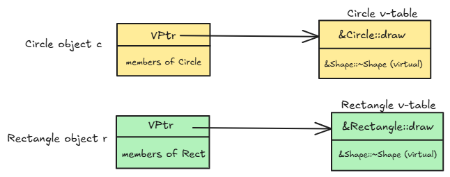

- [多态](#多态)
  - [多态的定义及实现](#多态的定义及实现)
    - [定义](#定义)
    - [实现多态的四个必要条件](#实现多态的四个必要条件)
    - [代码实现](#代码实现)
  - [抽象类](#抽象类)
  - [多态的原理](#多态的原理)

# 多态

多态的核心思想是 **“多种形态”** 或 **“多种行为”**。

在编程中，多态允许我们**使用一个统一的接口来操作不同类型的对象，并让这些对象各自产生不同的行为**。

一个生动的比喻：

想象一个通用的“播放”按钮（统一的接口）。

- 当你对一个MP3播放器按下“播放”按钮时，它会播放音乐。
- 当你对一台DVD播放机按下“播放”按钮时，它会播放视频。
- 当你对一个录音笔按下“播放”按钮时，它会播放录音。

“播放”这个指令是统一的，但不同的设备（对象）对这个指令的响应（行为）是不同的。这就是多态的本质。在C++中，这个“统一的接口”通常就是基类的指针或引用。

## 多态的定义及实现

### 定义

在C++中，多态是指当一个派生类的函数**重写 (override)** 了其基类的**虚函数 (virtual function)** 后，通过**基类的指针或引用**来调用该函数时，程序能够在运行时根据指针或引用所指向的**实际对象类型**（动态类型）来决定调用哪个版本的函数，而不是根据指针或引用自身的类型（静态类型）。这种在运行时才确定函数调用版本的机制被称为**动态绑定 (Dynamic Binding)** 或晚期绑定 (Late Binding)

### 实现多态的四个必要条件

要在C++中成功实现多态，必须同时满足以下四个条件：

1. **必须存在继承关系**：至少有一个基类和一个派生类。
2. **派生类必须重写基类的虚函数**：“重写”意味着函数签名（函数名、参数列表、`const`属性）必须完全相同。
3. **基类中的函数必须声明为 `virtual`**：这是启动动态绑定机制的开关。
4. **必须通过基类的指针或引用来调用虚函数**：这是触发多态行为的操作方式。

### 代码实现

```cpp
#include <iostream>

// 1. 基类
class Shape {
public:
    // 3. 声明为虚函数
    virtual void draw() const {
        std::cout << "Drawing a generic Shape." << std::endl;
    }
    // 补充：基类的析构函数通常也应为虚函数
    virtual ~Shape() {} 
};

// 2. 派生类 Circle，重写 draw()
class Circle : public Shape {
public:
    void draw() const override { // C++11的 override 关键字是最佳实践
        std::cout << "Drawing a Circle." << std::endl;
    }
};

// 2. 派生类 Rectangle，重写 draw()
class Rectangle : public Shape {
public:
    void draw() const override {
        std::cout << "Drawing a Rectangle." << std::endl;
    }
};

// 这是一个统一的接口
void render(const Shape& shape) {
    shape.draw(); // 这里的调用会发生多态
}

int main() {
    Circle c;
    Rectangle r;
    Shape s;

    // 4. 通过基类引用调用
    render(c); // 输出: Drawing a Circle.
    render(r); // 输出: Drawing a Rectangle.
    render(s); // 输出: Drawing a generic Shape.

    std::cout << "--------------------" << std::endl;

    // 4. 通过基类指针调用
    Shape* ptr_shape;
    ptr_shape = &c;
    ptr_shape->draw(); // 输出: Drawing a Circle.

    ptr_shape = &r;
    ptr_shape->draw(); // 输出: Drawing a Rectangle.

    return 0;
}
```

**补充知识点 `override` 和 `final` (C++11)**

- **`override`**：明确告诉编译器，这个函数意图重写一个基类的虚函数。如果基类中没有可被重写的虚函数，编译器会报错。这可以防止因拼写错误或参数不匹配导致重写失败。
- **`final`**：用于阻止进一步的继承或重写。`class Circle final : public Shape` 表示 `Circle` 不能再被继承。`virtual void draw() const final` 表示 `draw` 函数不能在 `Circle` 的子类中被再次重写。

**函数重写两个特殊规则**

协变返回类型 (Covariance)

- **核心规则**：派生类重写虚函数时，可以返回比基类**更具体**的指针或引用类型。
- **举例说明**：如果基类函数返回 `Animal*`，派生类 `Dog` 中重写的函数可以直接返回 `Dog*`。
- **主要目的**：为了**方便和类型安全**，让调用者无需进行多余的强制类型转换。

析构函数的重写

- **核心规则**：即使析构函数的名字不同（`~Base` vs `~Derived`），它们也构成重写关系。
- **触发条件**：前提是**基类的析构函数必须被声明为 `virtual`**。
- **主要目的**：为了在多态场景下（如 `delete base_ptr;`）能正确地销毁派生类对象，**防止资源泄漏**，并保证“先派生后基类”的正确析构顺序。

## 抽象类

**定义**：一个包含**纯虚函数** 的类被称为抽象类。

**纯虚函数**是一个在基类中只声明但没有定义的虚函数，其语法是在函数声明末尾加上 `= 0;`。

```cpp
class Shape {
public:
    // draw() 是一个纯虚函数
    virtual void draw() const = 0; 
    virtual ~Shape() {}
};
```

**抽象类的特点和作用：**

1. **不能被实例化**：不能创建抽象类的对象。例如，`Shape s;` 会导致编译错误。
2. **定义接口契约**：抽象类的主要目的是为派生类定义一个共同的接口“契约”。它告诉所有继承它的子类：“你们必须提供 `draw()` 函数的具体实现，否则你们自己也会成为抽象类。”
3. **强制实现多态**：它强迫派生类去重写纯虚函数，从而保证了多态接口的一致性和完整性。任何非抽象的派生类都一定能响应 `draw()` 调用。

## 多态的原理

多态之所以能在运行时工作，是因为编译器在背后做了一些额外的工作，主要是通过**虚函数表 (Virtual Function Table, v-table)** 和 **虚函数表指针 (Virtual Function Pointer, vptr)** 来实现的。

1. **虚函数表 (v-table)**：
   - 每个**拥有虚函数的类**（或继承自这样的类）都有一个自己独立的、静态的虚函数表。
   - 这个表本质上是一个函数指针数组，其中存放着该类所有虚函数的实际地址。如果派生类重写了某个虚函数，表中对应的条目就会更新为派生类版本的函数地址。
2. **虚函数表指针 (vptr)**：
   - 当一个类拥有虚函数时，编译器会为该类的**每一个对象**在内存布局中**悄悄地增加一个隐藏的指针成员**，这就是 `vptr`。
   - 对象的构造函数会自动设置这个 `vptr`，使其指向所属类的虚函数表 (v-table)。

调用过程：

当执行 `ptr_shape->draw();` 这样的多态调用时：

1. 程序首先访问 `ptr_shape` 指向的对象。
2. 通过对象内部的 `vptr` 指针，找到这个对象所属类的 v-table。
3. 在 v-table 中查找 `draw()` 函数对应的函数指针（通常在表中的固定偏移位置）。
4. 调用该函数指针所指向的函数。

由于 `Circle` 对象的 `vptr` 指向 `Circle` 类的 v-table（其中 `draw` 指向 `Circle::draw`），而 `Rectangle` 对象的 `vptr` 指向 `Rectangle` 类的 v-table，因此程序总能在运行时找到并调用正确的函数版本。

**图示：**



