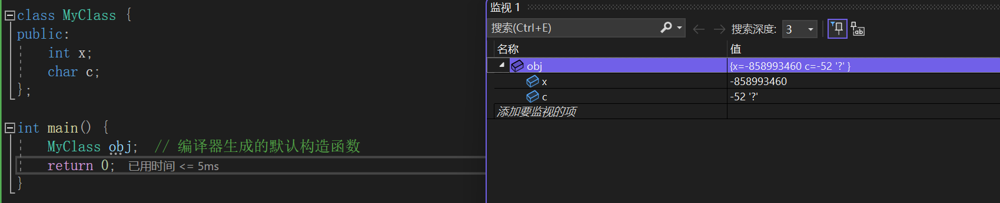

- [类与对象入门](#类与对象入门)
  - [类的引入](#类的引入)
  - [类的定义](#类的定义)
  - [类的访问限定符](#类的访问限定符)
  - [类的作用域](#类的作用域)
  - [类的实例化](#类的实例化)
  - [类的大小](#类的大小)
  - [空类的大小](#空类的大小)
  - [`this`指针](#this指针)
- [构造函数](#构造函数)
  - [构造函数的类型](#构造函数的类型)
  - [默认构造函数的作用](#默认构造函数的作用)
  - [构造函数初始化列表](#构造函数初始化列表)
- [析构函数](#析构函数)
  - [析构函数的语法](#析构函数的语法)
  - [析构函数的调用时机](#析构函数的调用时机)
  - [析构函数的作用](#析构函数的作用)
- [创建顺序与销毁顺序的关系](#创建顺序与销毁顺序的关系)
- [类的声明中为非静态成员变量提供默认值](#类的声明中为非静态成员变量提供默认值)
  - [**默认值与初始化的区别**](#默认值与初始化的区别)
  - [C++11 中的非静态成员变量默认值](#c11-中的非静态成员变量默认值)
- [拷贝构造函数](#拷贝构造函数)
  - [应用场景](#应用场景)
  - [拷贝构造函数的定义](#拷贝构造函数的定义)
  - [为什么需要拷贝构造函数？](#为什么需要拷贝构造函数)
  - [编写拷贝构造函数的注意事项](#编写拷贝构造函数的注意事项)
- [运算符重载](#运算符重载)
  - [运算符重载的基本语法](#运算符重载的基本语法)
  - [注意事项](#注意事项)
  - [不能重载的操作符](#不能重载的操作符)
- [`const`成员函数](#const成员函数)
  - [**声明和定义 `const` 成员函数**](#声明和定义-const-成员函数)
  - [`const` 成员函数的隐式 `this` 指针](#const-成员函数的隐式-this-指针)
  - [常见问题](#常见问题)
- [`explicit`关键字](#explicit关键字)
  - [**防止隐式类型转换**](#防止隐式类型转换)
  - [**什么时候使用 `explicit`**](#什么时候使用-explicit)
- [静态成员](#静态成员)
  - [静态成员变量](#静态成员变量)
  - [静态成员函数](#静态成员函数)
  - [**静态数据成员的初始化**](#静态数据成员的初始化)
  - [**静态成员变量的作用**](#静态成员变量的作用)
  - [**总结**](#总结)
  - [一个例子](#一个例子)

# 类与对象入门

## 类的引入

C语言中，结构体中只能定义变量，在C++中，结构体内不仅可以定义变量，也可以定义函数。

```cpp
struct Student
{
	void Print()
	{
		cout << "name:" << name << " age:" << age << endl;
	}

	string name;
	int year;
};
```

上面结构体的定义，在C++中更喜欢用`class`来代替 

## 类的定义

> 类是对现实世界中事物的抽象，它是对象的模板。类定义了对象的属性（成员变量）和行为（成员函数）。类本身并不占用内存，只有实例化成对象时才会在内存中分配空间。

类的定义包括类名、成员变量（属性）和成员函数（方法）。类通常会定义构造函数、析构函数、访问函数等。

```cpp
class Car {
public:
    string brand;  // 品牌
    int year;      // 年份

    // 构造函数
    Car(string b, int y) {
        brand = b;
        year = y;
    }

    // 成员函数
    void display() {
        cout << "Brand: " << brand << ", Year: " << year << endl;
    }
};
```

类定义的两种方式：

- 类的定义和声明一起
- 类的定义和声明分开

## 类的访问限定符

类的访问限定符决定了哪些成员变量和函数可以被访问。通常，类的成员分为三种访问级别：

- **public**：公共成员，可以被类的外部访问。
- **private**：私有成员，不能直接被类的外部访问，通常用于保护数据的封装。
- **protected**：保护成员，类似于 `private`，但允许派生类访问。

`class`的默认访问权限为private，`struct`为public(因为`struct`要兼容C）

## 类的作用域

类定义了一个新的作用域，类的所有成员都在类的作用域中。在类体外定义成员，需要使用` ::` 作用域解析符 指明成员属于哪个类域。

```cpp
class Car {
public:
    string brand;  // 品牌
    int year;      // 年份
    

    // 成员函数声明
    void display();
};


// 成员函数定义
// 这里需要指定display属于Car类
void Car::display() {
    cout << "Brand: " << brand << ", Year: " << year << endl;
}

```

## 类的实例化

类的实例化是创建类的对象。每次实例化一个类时，类的构造函数会被调用，分配内存给该对象，并初始化其成员变量。

```cpp
Car car1("Toyota", 2020);  // 创建一个 Car 类的对象 car1
car1.display();  // 调用成员函数
```

## 类的大小

类中既可以有成员变量，又可以有成员函数，那么一个类的对象中包含了什么？如何计算一个类的大小？ 

由于每个对象中的成员变量是不同的，但是调用的成员函数是相同的，所以对象中只保存成员变量，而成员函数放在公共代码区。

故一个类的大小就是该类中成员变量之和，当然还要进行内存对齐。

```cpp
class MyClass {

public:
	int a;      // 4 bytes
	char b;     // 1 byte
	double c;   // 8 bytes

	void Print() {
		cout << "a: " << a << " b: " << b << " c: " << c << endl;
	}
};
int main() {
	cout << sizeof(MyClass) << endl;  // 16
}
```

此处`MyClass` 的总大小为 `4 + 1 + 3 (填充字节) + 8 = 16` 字节，而不是 13 字节。

## 空类的大小

> 尽管一个空类没有任何成员变量，但它在内存中的大小并不是 0。这是因为每个类的对象至少需要一个唯一的地址，以便区分不同的对象。即使没有任何成员变量，编译器也会为空类的对象分配至少 1 字节的内存空间。

```cpp
#include <iostream>
using namespace std;

class Empty {};  // 空类

int main() {
    Empty obj;
    cout << "Size of Empty class: " << sizeof(obj) << " bytes" << endl;//1
    return 0;
}
```

**为什么空类的大小是 1 字节？**

- **唯一标识符**：即使类没有成员变量，编译器仍需要为每个对象分配至少 1 字节的内存。这样做的原因是，C++ 中的每个对象都必须有一个独一无二的地址。即使是空类的多个对象，它们也需要不同的内存地址，不能共享同一个地址。
- **实现细节**：为了支持对象的唯一性，编译器通常会为空类的每个实例保留 1 字节内存。这使得每个空类对象都可以拥有唯一的地址。

## `this`指针

> `this` 指针是 C++ 中一个非常特殊的指针，它是每个非静态成员函数中自动存在的一个隐式参数，指向当前对象的地址。`this` 指针对于类的每个实例都是唯一的，用来引用当前调用该成员函数的对象

**`this` 指针的特性**

- **隐式存在**：`this` 指针是隐式传递给非静态成员函数的，因此你不需要显式地声明它。
- **常量指针**：`this` 指针是一个常量指针，意味着你不能通过 `this` 修改它指向的对象。但你可以通过 `this` 访问对象的成员。
- **类型**：`this` 的类型是指向当前类类型的指针。例如，对于一个类 `MyClass`，成员函数中的 `this` 指针类型是 `MyClass*`。
- **仅对非静态成员函数有效**：`this` 指针只在非静态成员函数中有效，静态成员函数没有 `this` 指针，因为静态函数是属于类本身的，而不是某个对象的。

常见用法：

```cpp
class MyClass {
public:
    int value;

    MyClass(int value) {  // 构造函数的参数和成员变量同名
        this->value = value;  // 使用 this 指针区分成员变量和参数
    }

    void print() const {
        std::cout << "value = " << this->value << std::endl;  // 使用 this 指针访问成员变量
    }
};

int main() {
    MyClass obj(10);
    obj.print();  // 输出: value = 10
    return 0;
}
```

# 构造函数

> 构造函数是一个特殊的成员函数，在创建对象时自动调用。它的主要作用是初始化对象的成员变量。注意不是开空间创建对象。

构造函数有以下特点：

- **名称与类名相同**
- **没有返回值**
- 对象实例化时编译器**自动调用**对应的构造函数
- **可以有多个构造函数**（称为构造函数重载）

## 构造函数的类型

1. **无参数构造函数**：没有参数的构造函数

   ```cpp
   class student
   {
   public:
   	student() {
   		cout << "student()" << endl;
   	}
   private:
   	string _name;
   	int _age;
   	int _score;
   };
   
   ```

   注意：如果没有显式定义构造函数，编译器会提供一个默认的构造函数。一旦显式定义编译器将不再生成。

2. **带参数的构造函数**：允许对象通过参数来初始化成员变量（一般使用全缺省参数）

   ```cpp
   class student
   {
   public:
   	student(string name = "Bob", int age = 12, int score = 100) {
   	_name = name;
   	_age = age;
   	_score = score;
   	cout << "student(string name, int age, int score)" << endl;
   }
   
   private:
   	string _name;
   	int _age;
   	int _score;
   };
   ```

无参的构造函数和全缺省的构造函数都称为默认构造函数，并且默认构造函数**只能有一个**。

```cpp
class student
{
public:
	student() {
	cout << "student()" << endl;
	}

	student(string name = "Bob", int age = 12, int score = 100) {
	_name = name;
	_age = age;
	_score = score;
	cout << "student(string name, int age, int score)" << endl;
	}

private:
	string _name;
	int _age;
	int _score;
};

int main() {
	student s1;
	return 0;
}
```

因此以上代码无法通过编译。

调用 `student s1;` 时，编译器在解析时会遇到歧义。它会有两个可能的选择：

- 使用没有参数的默认构造函数 `student()`.
- 使用带默认参数的构造函数 `student(string name = "Bob", int age = 12, int score = 100)`，并将所有参数都使用默认值。

因为这两个构造函数在功能上是重叠的，所以编译器无法确定应该调用哪个构造函数，从而导致编译错误。

## 默认构造函数的作用

**内置类型成员**：如果没有显式初始化，编译器生成的默认构造函数不会对它们进行初始化，它们的值是未定义的（通常是随机值）

```cpp
class MyClass {
public:
    int x;
    char c;
};

int main() {
    MyClass obj;  // 编译器生成的默认构造函数
	return 0;
}
```



**自定义类型成员（类类型成员）**：编译器生成的默认构造函数会调用这些成员的默认构造函数

```cpp
class MyClass2 {
public:
	int x;
	int y;
	MyClass2() {
		x = 10;
		y = 20;
		cout << "MyClass2()" << endl;
	}

};

class MyClass1 {
public:
	int x;
	char c;
	MyClass2 obj2;// 调用MyClass2的构造函数
};

int main() {
    MyClass1 obj;  // 编译器生成的默认构造函数
	return 0;
}
```

执行程序就会发现，编译器生成默认的构造函数会对自定类型成员`MyClass2`调用的它的默认构造函数。

## 构造函数初始化列表

构造函数初始化列表是C++构造函数的一部分，它用于在构造函数体执行之前初始化类的成员变量。它位于构造函数的参数列表之后，使用冒号 `:` 开始。初始化列表的基本语法是：

```cpp
ClassName::ClassName(parameters) : member1(arg1), member2(arg2), ... {
    // 构造函数体
}
```

`member1(arg1), member2(arg2), ...` 是成员变量的初始化，它们在构造函数体执行之前就被初始化了。

- 以一个`:`开始
- 以`,`分割数据成员列表
- 每个"成员变量"后面跟一个放在括号中的初始值或表达式

**注意**

-  每个成员变量在初始化列表中只能出现一次(初始化只能初始化一次)
-  类中包含以下成员，**必须放在初始化列表位置进行初始化**：
   - `const`成员变量，`const` 成员变量一旦被创建就不能再被赋值。它们的值必须在对象构造完成之前确定
   - 引用成员变量，引用和 `const` 成员类似，必须在声明时初始化，并且一旦绑定就不能再引用其他对象
   - 自定义类型成员（该类没有默认构造函数）
-  构造函数的初始化列表中的成员变量是**按声明顺序初始化的**，而不是按列表中的顺序。因此，确保**初始化顺序与声明顺序一致**，以避免意外的行为。

# 析构函数

> 析构函数是 C++ 中用于销毁对象的特殊成员函数。当一个对象生命周期结束时（即对象被销毁时），析构函数会自动被调用。析构函数主要负责清理对象占用的资源，例如释放动态分配的内存、关闭文件、释放其他系统资源等。

## 析构函数的语法

```cpp
~ClassName();  // 析构函数
```

**名字**：析构函数的名字与类名相同，但前面有一个 `~`（波浪符）

**无返回值**：析构函数没有返回类型，不能有任何返回值

**无参数**：析构函数不能有参数，也不能被重载

**自动调用**：当对象的生命周期结束时，析构函数会自动被调用

## 析构函数的调用时机

析构函数会在以下几种情况下被自动调用：

- **栈上对象**：当对象的作用域结束时，栈上的对象会自动调用析构函数
- **动态分配的对象**：当使用 `new` 动态分配的对象通过 `delete` 释放时，析构函数会被调用
- **程序结束时**：如果对象是全局对象或者静态对象，它的析构函数会在程序结束时自动调用（通常在 `main()` 函数返回后）

## 析构函数的作用

析构函数的主要任务是清理对象在构造过程中分配的资源。例如：释放动态分配的内存对于通过 `new` 或其他动态分配方法获得的内存，析构函数负责通过 `delete` 或 `delete[]` 释放它们。

```cpp
class Stack
{
public:
	Stack(int n = 10) {
		arr = new int[n];
		size = 0;
		capacity = n;
	}
	~Stack() {
		delete[] arr;
		cout << "~Stack()" << endl;
	}
private:
	int* arr;
	int size;
	int capacity;
};
int main() {
	Stack s1;
	return 0;
}
```

程序将输出：

```scss
~Stack()
```

 `s1` 对象在 `main` 函数结束时被销毁，因此析构函数被调用并打印出这行信息。

**特殊**：C++ 不允许重载析构函数。每个类只能有一个析构函数，并且它不接受任何参数。

# 创建顺序与销毁顺序的关系

在 C++ 中，局部对象的 **销毁顺序** 与其 **创建顺序** 是相反的。这是因为局部对象在栈中分配内存，而栈的特性是 **后进先出（LIFO）**。具体规则如下：

- **创建顺序**：局部对象按照它们在代码中的 **声明顺序** 被创建。
- **销毁顺序**：局部对象按照它们的 **声明顺序的反向顺序** 被销毁，即 **最后创建的对象最先销毁**。

```cpp
class Stack
{
public:
	Stack(int n = 10) {
		arr = new int[n];
		size = 0;
		capacity = n;
		cout << this << "Stack(int n = 10)" << endl;
	}
	~Stack() {
		delete[] arr;
		cout << this;
		cout << "~Stack()" << endl;
	}
private:
	int* arr;
	int size;
	int capacity;
};
int main() {
	Stack s1;
	Stack s2;
	return 0;
}
```

输出：

```scss
0000001AF816F8C8Stack(int n = 10)
0000001AF816F8F8Stack(int n = 10)
0000001AF816F8F8~Stack()
0000001AF816F8C8~Stack()
```

**原因**

- **栈结构**：局部对象在栈上分配内存，栈是一个后进先出（LIFO）的数据结构。因此，最后创建的对象会最先销毁，先创建的对象会最后销毁。
- **析构函数调用顺序**：与构造函数相反，析构函数按照成员声明顺序的反向顺序调用。

# 类的声明中为非静态成员变量提供默认值

> C++11 引入了一个新特性，允许在类的声明中为 **非静态成员变量** 提供 **默认值**。但是需要注意的是，这并不是成员变量的“初始化”，而是为成员变量提供一个默认值。当你创建类的对象时，如果没有显式地为某个成员变量提供值，它将会使用这个默认值。

##  **默认值与初始化的区别**

- **默认值（Default Value）**：是在类声明中给成员变量指定一个初始值，表示如果没有显式地为该成员变量赋值，使用该默认值。默认值并不意味着在每个对象创建时都会执行初始化，它只是作为缺省值出现，编译器并不视其为初始化。
- **初始化（Initialization）**：是指在对象创建时，给成员变量分配一个明确的初始值。初始化通常通过构造函数来进行

## C++11 中的非静态成员变量默认值

C++11支持非静态成员变量在声明时进行初始化赋值，但是要注意这里不是初始化，这里是给声明的成员变量缺省值。

```cpp
class MyClass {
public:
    int x = 10;   // 默认值为 10
    double y = 3.14;  // 默认值为 3.14

    MyClass(int val) {
        x = val;  // 构造函数显式初始化 x
    }
};
```

在这个例子中，`x` 和 `y` 在声明时被赋予了默认值 `10` 和 `3.14`。如果在构造对象时没有提供相应的值，`x` 和 `y` 就会分别使用这些默认值。比如：

```cpp
MyClass obj1(5);  // x = 5, y = 3.14 (y 使用默认值)
MyClass obj2(20); // x = 20, y = 3.14 (y 使用默认值)
```

# 拷贝构造函数

> 拷贝构造函数是C++中的一个特殊构造函数，用于通过同类型的另一个对象来初始化当前对象。它主要用于对象的复制操作

## 应用场景

* **通过复制构造函数创建新对象**：当一个对象被用作另一个对象的初始化时，拷贝构造函数会被调用。

  ```cpp
  MyClass obj1;
  MyClass obj2 = obj1;  // 调用拷贝构造函数
  ```

* **将对象作为函数参数传递**（按值传递时）：当对象被传递给函数时，通常会调用拷贝构造函数。

  ```cpp
  void func(MyClass obj);
  MyClass obj1;
  func(obj1);  // 调用拷贝构造函数，复制一份
  ```

* **返回对象时**：当函数返回一个对象时，也会使用拷贝构造函数来创建返回值。

  ```cpp
  MyClass func() {
      MyClass obj;
      return obj;  // 调用拷贝构造函数，复制一份
  }
  ```

## 拷贝构造函数的定义

拷贝构造函数通常有以下形式：

```cpp
ClassName(const ClassName& other);
```

其中：

- `ClassName`是类的名称。
- `const ClassName& other`是常量引用参数，表示源对象。
- 拷贝构造函数的**参数只有一个**且必须使用**引用传参**，使用**传值方式**会引发**无穷递归调用**。
- **若未显示定义，系统生成默认的拷贝构造函数**。 默认的拷贝构造函数对象按内存存储按字节序完成拷贝，这种拷贝我们叫做浅拷贝，或者值拷贝。

## 为什么需要拷贝构造函数？

> 默认情况下，C++会为你生成一个拷贝构造函数，它执行逐成员复制（即按成员逐一赋值）。但是，默认拷贝构造函数可能不适用于某些场景，特别是当对象包含指向动态分配内存的指针时。如果你不自定义拷贝构造函数，编译器生成的拷贝构造函数将执行浅拷贝，即**拷贝指针的值**而不是**拷贝它们指向的数据**。这样可能导致“悬挂指针”和内存泄漏等问题。

**浅拷贝**：默认的拷贝构造函数会进行成员逐一复制。如果类包含指针成员，浅拷贝只会复制指针的值（即地址），而不会复制指针指向的内容。

**深拷贝**：在自定义的拷贝构造函数中，我们需要显式地为动态分配的内存进行复制，以确保每个对象拥有独立的资源。

浅拷贝会导致以下问题：

- **悬挂指针**：多个对象共享同一块内存，当一个对象被销毁时，其他对象可能仍然持有指向已释放内存的指针。
- **内存泄漏**：多个对象共享内存，但没有正确的释放机制，导致内存无法被回收。
- **双重释放**：多个对象共享同一块内存，在销毁时可能尝试重复释放内存，导致程序崩溃。
- **不正确的行为**：多个对象共享同一内存，修改其中一个对象的值时，其他对象的值也会被意外修改，导致不期望的行为

## 编写拷贝构造函数的注意事项

- **避免自我赋值**：在拷贝构造函数中，应该检查对象是否与自身进行赋值，以避免不必要的操作。

  ```cpp
  MyClass(const MyClass& other) {
      if (this != &other) {  // 确保不是自我赋值
          //...
      }
  }
  ```

- **处理资源管理**：如果对象中包含动态分配的内存或资源，需要确保拷贝构造函数能够正确处理资源的分配和释放，防止资源泄露。

# 运算符重载

> 运算符重载是C++中的一项强大特性，它允许你为自定义类型定义或重新定义运算符的行为，使得你可以像使用内置类型一样使用自定义类型进行运算。运算符重载可以使代码更简洁、易读，同时也能提高代码的灵活性

## 运算符重载的基本语法

运算符重载的语法是通过成员函数或者非成员函数来实现的，具体形式如下：

* **成员函数形式**：如果运算符的左操作数是类的对象，那么你可以在类内部定义一个成员函数来重载该运算符。相当于左操作数是`this`指向的调用函数的对象

  ```cpp
  ReturnType operator 运算符(参数列表) {
      // 操作符重载的实现
  }
  ```

* **非成员函数形式**：如果左操作数不是类的对象（例如，如果左操作数是常量或是其他类的对象），可以通过非成员函数来重载运算符。

  ```cpp
  ReturnType operator 运算符(const 类类型& obj, 参数列表) {
      // 操作符重载的实现
  }
  ```

示例：

```cpp
class Date {
public:
	Date(int year = 0,int month = 1, int day = 1) {
		_year = year;
		_month = month;
		_day = day;
	}
	bool operator==(const Date& d) {
		return _year == d._year && _month == d._month && _day == d._day;
	}
private:
	int _year;
	int _month;
	int _day;
};
```

## 注意事项

- 不能通过链接其他符号来创建**新的操作符**，例如`operator@`
- 作为类成员的重载函数时，其形参看起来比操作数数目少1成员函数的操作符有一个默认的形参`this`，限定为第一个形参

## 不能重载的操作符

**成员访问运算符**

- `.`（成员访问运算符）：用于访问对象的成员，不能重载。
- `->`（成员指针运算符）：用于访问指针对象的成员，不能重载。

**条件运算符（三目运算符）**

- `?:`：这是条件运算符，它的行为已经定义好，不能被重载。

 **类型转换运算符**

- `sizeof`：用于获取类型或对象大小的运算符，不能重载。

 **成员指针运算符**

- `.*` 和 `->*`：这两个运算符用于访问对象的成员指针，不能被重载。

**作用域解析运算符** 

- `::` ：用于限定作用域，不能被重载

# `const`成员函数

> `const` 成员函数是 C++ 中的一种特殊成员函数，它承诺不会修改类的任何非 `const` 成员变量。实际上，`const` 修饰的是该成员函数隐式的 `this` 指针类型。使用 `const` 成员函数的主要目的是保证对象的状态不会在该函数调用过程中发生改变。

##   **声明和定义 `const` 成员函数**

在 C++ 中，`const` 成员函数的声明和定义是通过在成员函数的末尾加上 `const` 来实现的。

```cpp
class MyClass {
public:
    MyClass(int value) : data(value) {}

    // const 成员函数，保证不会修改对象的成员变量
    void showData() const {
        std::cout << "Data: " << data << std::endl;
    }

private:
    int data;
};
```

在这个例子中，`showData()` 是一个 `const` 成员函数，它不能修改 `MyClass` 对象的任何数据成员。

## `const` 成员函数的隐式 `this` 指针

> `const` 成员函数与普通成员函数的一个重要区别在于，它的 `this` 指针是 `const` 类型。这意味着，在 `const` 成员函数中，你不能通过 `this` 指针修改对象的非 `const` 成员变量。

具体来说，`const` 成员函数的 `this` 指针的类型是 `const MyClass*`，因此无法通过该指针来修改对象的状态。

```cpp
class MyClass {
public:
    MyClass(int value) : data(value) {}

    // const 成员函数
    void showData() const {
        // data = 10;  // 错误：不能修改 const 成员函数中的非 const 成员
    }

private:
    int data;
};
```

## 常见问题

* `const` 对象可以调用非 `const` 成员函数吗？
  **不可以**，`const` 对象不能调用可能修改状态的非 `const` 成员函数。

* 非 `const` 对象可以调用 `const` 成员函数吗？
  **可以**，非 `const` 对象可以调用 `const` 成员函数，因为 `const` 成员函数保证不修改对象的状态。

* `const` 成员函数内可以调用其它的非 `const` 成员函数吗？
  **不可以**，`const` 成员函数承诺不修改对象的状态，不能调用可能修改状态的非 `const` 成员函数。

* 非 `const` 成员函数内可以调用其它的 `const` 成员函数吗？
  **可以**，非 `const` 成员函数可以调用 `const` 成员函数，因为 `const` 成员函数不会修改对象状态。

* 什么时候会给成员函数加`const`?

  只要成员函数中**不修改成员变量**最好都加上`const`

# `explicit`关键字

> `explicit` 是 C++ 中的一个关键字，用于修饰构造函数或转换运算符，目的是防止编译器进行隐式类型转换。它主要用于防止构造函数或转换运算符在不明确的情况下被自动调用。

## **防止隐式类型转换**

当没有 `explicit` 关键字时，C++ 编译器可以在某些情况下自动将一个类型转换为另一个类型，这就是所谓的隐式类型转换。比如：

```cpp
class MyClass {
public:
    MyClass(int val) {
        // 构造函数
    }
};

void func(MyClass obj) {
    //...
}

int main() {
    func(10);  // 这里10会隐式地转换为MyClass(10)
    return 0;
}
```

在上面的代码中，`func` 函数期望一个 `MyClass` 类型的参数，编译器会自动使用 `MyClass(int)` 构造函数将 `10` 转换为 `MyClass` 对象。这种隐式转换有时会导致意外的行为，特别是当有多个重载构造函数时。

为了防止这种隐式类型转换，可以使用 `explicit` 关键字修饰构造函数：

```cpp
class MyClass {
public:
    explicit MyClass(int val) {
        // 构造函数
    }
};
```

在这个例子中，`MyClass(int)` 被标记为 `explicit`，所以编译器不会允许隐式地将 `int` 转换为 `MyClass` 类型。如果你需要手动进行转换，可以显式调用构造函数：

```cpp
func(MyClass(10));  // 显式调用构造函数
```

## **什么时候使用 `explicit`**

- **避免意外的隐式转换**：一个单参数的构造函数，尤其是当它可以与其他类型的构造函数重载时，应该使用 `explicit` 以防止自动类型转换带来意外的行为。
- **控制类型转换的时机**：希望类型转换只在明确的情况下进行，而不是编译器自动推断时，就应该使用 `explicit`。

# 静态成员

> 在 C++ 中，`static` 关键字用于定义静态成员变量和静态成员函数。`static` 成员具有一些独特的属性

## 静态成员变量

**定义**：

- **静态成员变量**属于类，而不属于类的任何特定对象。这意味着静态成员变量**对于所有对象是共享的**，而不是每个对象都有自己的副本。
- 静态成员变量必须在类外部进行定义，否则编译器会报错。

 **特性**

- **共享性**：所有类的对象都共享静态成员变量。无论创建多少个对象，它们都访问同一个静态成员变量。
- **生命周期**：静态成员变量的生命周期与程序的生命周期相同，它在整个程序运行期间存在。
- **内存分配**：静态成员变量只会在程序启动时分配一次内存，不同对象之间共享这一块内存。

## 静态成员函数

**定义**

- **静态成员函数**是属于类本身的函数，而不是属于类的对象。静态成员函数只能访问**类的静态成员变量和静态成员函数**，因为它们与具体的对象无关。
- 静态成员函数不能访问非静态成员变量和非静态成员函数，因为静态函数没有 `this` 指针。

**特性**

- **不需要对象**：静态成员函数可以直接通过类名调用，而不需要实例化对象。
- **访问限制**：静态成员函数只能访问静态成员变量或其他静态成员函数，无法访问普通的非静态成员。

## **静态数据成员的初始化**

- 静态数据成员在类内声明时可以指定默认值，但它必须在**类外**进行定义和初始化。
- 静态成员变量的定义通常在类外进行，而不能仅仅在类内部声明。

##  **静态成员变量的作用**

- **共享数据**：静态成员变量对于所有的类对象是共享的。这使得它非常适合存储那些与类的所有实例共享的数据，如类的实例计数、全局配置等。
- **对象间共享状态**：静态成员变量可以用于在多个对象之间共享状态。例如，创建一个计数器来记录类的对象数。

##  **总结**

**静态成员变量**：

- 属于类，所有对象共享
- 生命周期与程序相同
- 通常在**类外定义和初始化**
- 通过 `ClassName::member_name` 访问

**静态成员函数**：

- 属于类，没有 `this` 指针
- 只能直接访问类的静态成员
- 通过 `ClassName::function_name()` 调用

## 一个例子

创建一个计数器来记录类的对象数

```cpp
class MyClass
{
public:
	MyClass()
	{
		_count++;// 每次创建对象，_count++
	}
	static int GetCount()
	{
		return _count;
	}
private:
	static int _count;// 静态成员变量
};
int MyClass::_count = 0;// 静态成员变量初始化
int main() {
	MyClass m1, m2, m3;
	cout << MyClass::GetCount() << endl;
	return 0;
}
```

