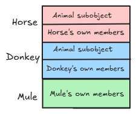
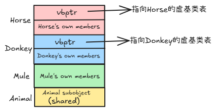

- [继承](#继承)
  - [继承的基本语法](#继承的基本语法)
  - [基类和派生类对象之间的赋值转换](#基类和派生类对象之间的赋值转换)
    - [派生类对象赋值给基类对象（对象切片 Slicing）](#派生类对象赋值给基类对象对象切片-slicing)
    - [派生类指针/引用赋值给基类指针/引用（向上转型 Upcasting）](#派生类指针引用赋值给基类指针引用向上转型-upcasting)
    - [基类指针/引用赋值给派生类指针/引用（向下转型 Downcasting）](#基类指针引用赋值给派生类指针引用向下转型-downcasting)
    - [总结](#总结)
  - [继承中的作用域和名字隐藏](#继承中的作用域和名字隐藏)
    - [继承中的作用域嵌套](#继承中的作用域嵌套)
    - [名字隐藏](#名字隐藏)
    - [如何解决名字隐藏](#如何解决名字隐藏)
      - [方法一：使用作用域解析运算符 `::`](#方法一使用作用域解析运算符-)
      - [方法二：使用 `using` 声明](#方法二使用-using-声明)
    - [**总结**](#总结-1)
  - [派生类的默认成员函数](#派生类的默认成员函数)
    - [默认构造函数 `Derived()`](#默认构造函数-derived)
    - [析构函数 `~Derived()`](#析构函数-derived)
    - [拷贝构造函数 `Derived(const Derived& other)`](#拷贝构造函数-derivedconst-derived-other)
    - [拷贝赋值运算符 `Derived& operator=(const Derived& other)`](#拷贝赋值运算符-derived-operatorconst-derived-other)
    - [总结](#总结-2)
  - [继承与友元](#继承与友元)
  - [继承与静态成员](#继承与静态成员)
    - [静态成员变量](#静态成员变量)
    - [静态成员函数](#静态成员函数)
  - [多重继承](#多重继承)
    - [菱形继承](#菱形继承)
    - [虚继承](#虚继承)
    - [**内存布局**和**实现机制**](#内存布局和实现机制)
      - [虚继承的实现机制与内存布局](#虚继承的实现机制与内存布局)
      - [解决数据冗余和二义性](#解决数据冗余和二义性)
      - [总结](#总结-3)

# 继承

> 继承是面向对象编程 (OOP) 的三大核心特性之一（另外两个是封装和多态）。它允许我们创建一个新类（称为**派生类**或**子类**），这个新类可以获取另一个已存在的类（称为**基类**或**父类**）的属性和方法，而无需重写这些代码。

## 继承的基本语法

继承的语法非常直观，使用冒号 `:` 来表示。

```cpp
class Base {
    // 基类的成员 (属性和方法)
};

class Derived : access_specifier Base {
    // 派生类的成员
};
```

- `class Derived`：这是派生类。
- `class Base`：这是基类。
- `:`：表示 `Derived` 继承自 `Base`。
- `access_specifier`：这是**继承方式**，非常关键。它决定了基类的成员在派生类中的访问权限。

C++ 中有三种继承方式：`public`, `protected`, 和 `private`。这个选择会影响基类成员在派生类中的“可见性”。

为了理解继承方式，我们首先要回顾一下类的成员访问权限：

- `public`：在任何地方都可以访问
- `protected`：只能在类内部和其派生类中访问
- `private`：只能在类内部访问

下表总结了不同的继承方式如何改变基类成员在派生类中的访问权限：

| 基类成员权限 | public继承 | protected继承 | private继承 |
| ------------ | ---------- | ------------- | ----------- |
| public       | public     | protected     | private     |
| protected    | protected  | protected     | private     |
| private      | 不可见     | 不可见        | 不可见      |

## 基类和派生类对象之间的赋值转换

### 派生类对象赋值给基类对象（对象切片 Slicing）

可以将一个派生类的对象直接赋值给一个基类的对象。

**语法：**

```cpp
Base b;
Derived d;
b = d; // 合法
```

**发生了什么？**

当你执行 `b = d;` 时，并不会发生多态。这个操作会调用基类 `Base` 的赋值运算符 `operator=`。这个过程只会将 `d` 对象中**从基类继承来的那一部分成员**拷贝到 `b` 对象中。这个过程被称为 **“对象切片 (Slicing)”**。

**切片的含义：**

想象一个派生类对象 `d`，它包含了基类部分和自己独有的部分。当把它赋值给基类对象 `b` 时，它自己独有的那部分（成员变量、方法等）就像被一把刀“切掉”了，只剩下和基类兼容的部分被复制过去。

**代码示例：**

```cpp
#include <iostream>
#include <string>

class Animal {
public:
    std::string name;
};

class Dog : public Animal {
public:
    int age;
};

int main() {
    Dog myDog;
    myDog.name = "Buddy";
    myDog.age = 3;

    Animal myAnimal;
    myAnimal = myDog; // 这里发生了对象切片

    std::cout << "myAnimal's name: " << myAnimal.name << std::endl;
    // std::cout << myAnimal.age; // 编译错误！Animal 类没有 age 成员
    
    return 0;
}
```

**从例子中可以看到：**

- `myDog` 的 `name` 成员（继承自 `Animal`）被成功拷贝给了 `myAnimal`。
- `myDog` 独有的 `age` 成员被“切掉”了，`myAnimal` 对象中不存在这个成员。

**总结：对象切片是危险的，通常应该避免。** 它会丢失派生类的信息，并可能导致非预期的行为。实现多态的正确方式是使用指针或引用。

### 派生类指针/引用赋值给基类指针/引用（向上转型 Upcasting）

这是实现多态的关键，也是非常安全和常见的操作。

可以让一个基类的指针或引用，指向或引用一个派生类的对象。这个过程被称为 **向上转型 (Upcasting)**，因为你在继承层次结构中从下（派生类）指向上（基类）。

**语法：**

```cpp
// 使用指针
Derived d;
Base* ptr_b = &d; // 合法

// 使用引用
Derived d2;
Base& ref_b = d2; // 合法
```

**为什么是安全的？**

因为派生类对象 "is-a" (是一个) 基类对象。它包含了基类的所有成员和方法，所以通过基类指针/引用去访问这些成员是绝对安全的。编译器在编译时就知道这种转换是合法的。

**向上转型与多态：**

当通过基类指针或引用调用一个**虚函数 (virtual function)** 时，就会发生多态。程序会在运行时检查指针/引用所指向的**实际对象类型**，并调用相应版本的函数。

**代码示例：**

```cpp
#include <iostream>

class Shape {
public:
    virtual void draw() { // 虚函数
        std::cout << "Drawing a generic shape." << std::endl;
    }
    virtual ~Shape() {} // 虚析构函数
};

class Circle : public Shape {
public:
    void draw() override { // 重写虚函数
        std::cout << "Drawing a circle." << std::endl;
    }
};

void render(Shape& shape) { // 使用基类引用接收参数
    shape.draw();
}

int main() {
    Circle myCircle;

    // 向上转型
    Shape* shapePtr = &myCircle;
    Shape& shapeRef = myCircle;

    // 通过指针和引用调用虚函数，触发多态
    shapePtr->draw(); // 输出: Drawing a circle.
    shapeRef.draw(); // 输出: Drawing a circle.

    // 传递派生类对象给需要基类引用的函数
    render(myCircle); // 输出: Drawing a circle.

    return 0;
}
```

### 基类指针/引用赋值给派生类指针/引用（向下转型 Downcasting）

将一个基类的指针或引用，转换为一个派生类的指针或引用，被称为 **向下转型 (Downcasting)**。

**这种转换是潜在不安全的。**

**为什么不安全？**

因为一个基类指针可能指向一个基类对象，也可能指向一个派生类对象。如果你尝试将一个指向**纯基类对象**的指针，强制转换为派生类指针，然后试图访问派生类独有的成员，这将导致未定义行为（通常是程序崩溃）。

**代码示例（不安全的方式）：**

```cpp
Animal myAnimal;
Dog* dogPtr;

// dogPtr = &myAnimal; // 编译错误，不允许隐式向下转型

// 使用 static_cast 强制转型（不安全）
dogPtr = static_cast<Dog*>(&myAnimal);

// 危险操作！myAnimal 对象中根本没有 age 成员
// 下面这行代码会导致未定义行为
dogPtr->age = 5;
```

**安全的向下转型方式：`dynamic_cast`**

C++ 提供了 `dynamic_cast` 来进行安全的运行时类型检查和向下转型。它只对**多态类型**（即至少有一个虚函数的类）有效。

- 如果转换成功（指针确实指向一个派生类对象），它会返回一个有效的派生类指针。
- 如果转换失败（指针指向的是一个基类对象或其他不相关的派生类对象），它会返回 `nullptr`。
- 对于引用类型，如果转换失败，它会抛出 `std::bad_cast` 异常。

**代码示例（安全的方式）：**

```cpp
#include <iostream>

// (接上面的 Shape 和 Circle 类的定义)
class Square : public Shape {
public:
    void draw() override {
        std::cout << "Drawing a square." << std::endl;
    }
};


int main() {
    Circle myCircle;
    Square mySquare;
    Shape* shapePtr;

    // 1. 指向 Circle 对象，尝试转换为 Circle* (成功)
    shapePtr = &myCircle;
    Circle* circlePtr = dynamic_cast<Circle*>(shapePtr);
    if (circlePtr) {
        std::cout << "Cast to Circle* successful." << std::endl;
        circlePtr->draw();
    } else {
        std::cout << "Cast to Circle* failed." << std::endl;
    }

    // 2. 指向 Circle 对象，尝试转换为 Square* (失败)
    shapePtr = &myCircle;
    Square* squarePtr = dynamic_cast<Square*>(shapePtr);
     if (squarePtr) {
        std::cout << "Cast to Square* successful." << std::endl;
    } else {
        std::cout << "Cast to Square* failed. Pointer is nullptr." << std::endl;
    }

    return 0;
}
```

### 总结

| 转换类型                             | 描述                                                         | 安全性与建议                                                 |
| ------------------------------------ | ------------------------------------------------------------ | ------------------------------------------------------------ |
| **派生类对象 -> 基类对象**           | **对象切片 (Slicing)**。派生类独有部分被丢弃，只拷贝基类部分。 | **不安全，通常应避免**。会丢失信息，破坏多态。               |
| **派生类指针/引用 -> 基类指针/引用** | **向上转型 (Upcasting)**。隐式转换，总是安全的。             | **安全且常用**。这是实现多态和编写通用代码的基础。           |
| **基类指针/引用 -> 派生类指针/引用** | **向下转型 (Downcasting)**。需要显式转换。                   | **潜在不安全**。如果需要向下转型，**必须使用 `dynamic_cast`** 进行运行时检查，以确保转换的合法性。 |

## 继承中的作用域和名字隐藏

### 继承中的作用域嵌套

当一个类 `Derived` 继承自 `Base` 时，你可以想象 `Base` 类的作用域是 `Derived` 类作用域的**外部嵌套作用域**。

这就像我们在普通函数中定义的嵌套代码块一样：

```cpp
int x = 10; // 全局作用域

void func() {
    int x = 20; // func 的局部作用域
    {
        // 内部代码块作用域
        int x = 30;
        cout << x; // 输出 30 (优先使用最内层作用域)
        cout << ::x; // 输出 10 (使用全局作用域)
    }
    cout << x; // 输出 20 (使用 func 的局部作用域)
}
```

在继承中，派生类的作用域是“内层”，基类的作用域是“外层”。当编译器在派生类中查找一个名字（变量名或函数名）时，它会：

1. 首先在**派生类自身的作用域**内查找。
2. 如果找到了，就停止查找。
3. 如果没找到，它才会去**基类的作用域**中查找。
4. 如果还没找到，就继续向更外层的基类查找（在多级继承中），直到最终的基类。
5. 如果所有基类都找不到，最后会去全局作用域查找。

这个查找规则直接导致了“名字隐藏”现象。

### 名字隐藏

**核心规则：** 如果派生类中声明了一个和基类中**同名**的成员（无论是成员变量还是成员函数），那么**基类中的同名成员将会被隐藏**。

注意，这里的“隐藏”与访问权限（`public`, `protected`, `private`）无关，也与函数的参数列表或返回类型无关。**只要名字相同，就会发生隐藏。**

这与**函数重写 (Overriding)** 是完全不同的概念：

- **名字隐藏**：只关心**名字**是否相同。
- **函数重写**：要求函数**签名**（函数名、参数列表、`const`属性等）必须完全相同，并且基类函数必须是 `virtual`。

**示例 1：成员函数的隐藏**

```cpp
#include <iostream>

class Base {
public:
    void func() {
        std::cout << "Base::func() with no arguments" << std::endl;
    }
};

class Derived : public Base {
public:
    // 这个 func 隐藏了 Base 中名为 func 的函数
    void func(double y) {
        std::cout << "Derived::func(double) with one argument: " << y << std::endl;
    }
};

int main() {
    Derived d;

    d.func(3.14); // 正确，调用 Derived::func(double)

    // d.func();      // COMPILE ERROR!
}
```

**为什么会编译错误？**

1. 当编译器看到 `d.func()`  时，它首先在 `Derived` 类的作用域中查找名为 `func` 的成员。
2. 它找到了 `void func(double y)`。**于是查找立即停止。**
3. 编译器不会再继续去 `Base` 类的作用域中查找。
4. 然后，它尝试将调用（例如 `d.func()`）与它找到的唯一的 `func`（即 `func(double)`) 进行匹配。发现参数列表不匹配，于是报告编译错误。

它不会因为 `Derived` 中没有匹配的函数就去 `Base` 中寻找，因为 `Base` 中的 `func` 已经被**名字隐藏**了。

**示例 2：成员变量的隐藏**

```cpp
#include <iostream>

class Base {
public:
    int value = 10;
};

class Derived : public Base {
public:
    double value = 20.5; // 隐藏了 Base::value
};

int main() {
    Derived d;
    std::cout << d.value << std::endl; // 输出 20.5，访问的是 Derived::value
}
```

在这里，`Derived` 中的 `value` 隐藏了 `Base` 中的 `value`。

### 如何解决名字隐藏

如果我们确实希望在派生类中既能使用自己的新函数，又能使用基类中被隐藏的函数，该怎么办？有两种主要方法。

#### 方法一：使用作用域解析运算符 `::`

我们可以使用 `Base::` 来显式地告诉编译器，我们要调用的是基类作用域中的那个版本。

```cpp
int main() {
    Derived d;

    d.func(3.14); // 调用 Derived::func(double)

    // 使用 :: 显式调用基类的版本
    d.Base::func();      // 正确，输出 "Base::func() with no arguments"
    d.Base::func(10);    // 正确，输出 "Base::func(int) with one argument: 10"
}
```

这种方法简单直接，但每次调用基类版本时都需要写 `Base::`，比较繁琐。

#### 方法二：使用 `using` 声明

这是更常用、更优雅的方法。我们可以在派生类中使用 `using` 关键字，将基类的同名成员“引入”到派生类的作用域中。

```cpp
class Derived : public Base {
public:
    // 使用 using 将 Base 类中所有名为 func 的成员引入到 Derived 的作用域
    using Base::func;

    // 现在 Derived 的作用域中同时“可见” Base::func 和 Derived::func
    void func(double y) {
        std::cout << "Derived::func(double) with one argument: " << y << std::endl;
    }
};

int main() {
    Derived d;

    // 现在所有的调用都合法了
    d.func();      // 调用 Base::func()
    d.func(10);    // 调用 Base::func(int)
    d.func(3.14);  // 调用 Derived::func(double)
}
```

`using Base::func;` 这行代码的含义是：“请把 `Base` 类中所有叫做 `func` 的东西都拿到 `Derived` 类的作用域里来，让它们也成为重载函数集合的一部分。” 这样一来，名字隐藏就被打破了，编译器在 `Derived` 的作用域里就能同时看到来自基类和派生类的三个 `func` 函数，然后根据函数重载的规则选择最匹配的一个。

### **总结**

| 特性         | 名字隐藏 (Name Hiding)                                       | 函数重写 (Overriding)                                      |
| ------------ | ------------------------------------------------------------ | ---------------------------------------------------------- |
| **触发条件** | 派生类成员与基类成员**同名**                                 | 派生类函数与基类虚函数**签名完全相同**                     |
| **关心什么** | 只关心**名字**                                               | 关心**函数签名**（名字、参数、`const`等）                  |
| **基类要求** | 无特殊要求                                                   | 基类函数必须是 `virtual`                                   |
| **效果**     | 基类同名成员在派生类作用域中变得“不可见”，除非显式指定作用域 | 实现**多态**。通过基类指针或引用调用时，会执行派生类的版本 |
| **解决方法** | 使用作用域解析符 `::` 或 `using` 声明                        |                                                            |

## 派生类的默认成员函数

### 默认构造函数 `Derived()`

- 编译器自动生成的行为

  当派生类没有定义任何构造函数时，编译器会尝试生成一个默认构造函数。这个自动生成的函数做的第一件事就是调用基类的默认构造函数 `Base()`，以确保基类子对象被正确初始化。之后才会初始化派生类自己的成员。

- 自定义时的核心责任

  如果基类没有默认构造函数（例如，基类只有一个需要参数的构造函数 `Base(int)`），编译器将无法为派生类生成默认构造函数，并会报告编译错误。

  在这种情况下，如果希望派生类能被默认构造，就必须亲自为派生类定义一个默认构造函数，并在其构造函数初始化列表中显式地调用基类一个可用的构造函数。

- **代码示例**

  ```cpp
  class Base {
  public:
      // 基类没有默认构造函数
      Base(int value) : base_value_(value) {}
  private:
      int base_value_;
  };
  
  class Derived : public Base {
  public:
      // 责任：必须定义构造函数，并在初始化列表调用基类构造函数
      Derived() : Base(0) { /* ... */ }
  };
  ```

### 析构函数 `~Derived()`

- 编译器自动生成的行为

  析构函数的调用顺序是固定的，与构造函数相反。当一个派生类对象被销毁时，会先执行派生类的析构函数体，然后自动调用基类的析构函数。这个调用链是编译器自动处理的，你永远不需要手动调用基类的析构函数

- 自定义时的核心责任（至关重要）

  如果类体系设计为多态使用，那么基类的析构函数必须被声明为 `virtual`。如果基类析构函数不是虚函数，那么通过基类指针 `delete` 一个派生类对象时，只会调用基类的析构函数，派生类的析构函数将被跳过，从而导致派生类中分配的资源无法释放，引发资源泄漏。

- **代码示例**

  ```cpp
  class Base {
  public:
      // 责任：为支持多态删除，基类析构函数应为虚函数
      virtual ~Base() { /* 清理基类资源 */ }
  };
  
  class Derived : public Base {
  public:
      ~Derived() { /* 清理派生类资源... 此后会自动调用 ~Base() */ }
  };
  
  // 正确用法
  Base* ptr = new Derived();
  delete ptr; // 会正确调用 ~Derived() 和 ~Base()
  ```

### 拷贝构造函数 `Derived(const Derived& other)`

- 编译器自动生成的行为

  编译器生成的拷贝构造函数会执行“成员式拷贝”。它会首先调用基类的拷贝构造函数 `Base(other)` 来完成基类部分的拷贝，然后再对派生类自己的成员变量逐一进行拷贝构造。

- 自定义时的核心责任

  如果为派生类定义了自己的拷贝构造函数（例如，为了实现深拷贝），编译器将不再负责基类部分。必须在派生类拷贝构造函数的初始化列表中，显式地调用基类的拷贝构造函数。如果遗漏，基类部分将会被默认构造，而不是被拷贝。

- **代码示例**

  ```cpp
  class Derived : public Base {
  public:
      // 责任：在初始化列表手动调用基类的拷贝构造函数
      Derived(const Derived& other)
          : Base(other) // <-- 显式调用以拷贝基类部分
          /* ...拷贝派生类成员... */
      {
      }
  };
  ```

### 拷贝赋值运算符 `Derived& operator=(const Derived& other)`

- 编译器自动生成的行为

  编译器生成的拷贝赋值运算符会执行“成员式赋值”。它会自动调用基类的拷贝赋值运算符 `Base::operator=(other)` 来完成基类部分的赋值，然后再对派生类成员逐一赋值。

- 自定义时的核心责任

  自定义了拷贝赋值运算符，必须手动处理基类部分的赋值。与构造函数不同，这需要在函数体内部完成。

- **代码示例**

  ```cpp
  class Derived : public Base {
  public:
      // 责任：在函数体内手动调用基类的 operator=
      Derived& operator=(const Derived& other) {
          if (this == &other) {
              return *this;
          }
          Base::operator=(other); // <-- 显式调用以赋值基类部分
          /* ...赋值派生类成员... */
          return *this;
      }
  };
  ```

### 总结

| 成员函数     | 编译器自动生成的行为              | 自定义时的核心责任                                         |
| ------------ | --------------------------------- | ---------------------------------------------------------- |
| **默认构造** | 自动调用 `Base()`                 | 如果 `Base()` 不存在，必须在**初始化列表**调用 `Base(...)` |
| **析构**     | 自动调用 `~Base()`                | 将 `~Base()` 声明为 **`virtual`** (用于多态)               |
| **拷贝构造** | 自动调用 `Base(other)`            | 在**初始化列表**中手动调用 `Base(other)`                   |
| **拷贝赋值** | 自动调用 `Base::operator=(other)` | 在**函数体**中手动调用 `Base::operator=(other)`            |

## 继承与友元

1. **基类的友元不是派生类的友元**：如果函数 `func` 是基类 `Base` 的友元，它只能访问 `Base` 的 `private` 和 `protected` 成员。它不能访问派生类 `Derived` 新增的 `private` 或 `protected` 成员。
2. **派生类的友元不是基类的友元**：如果函数 `func` 是派生类 `Derived` 的友元，它可以访问 `Derived` 的所有成员，但不能仅凭此关系就访问基类 `Base` 的 `private` 或 `protected` 成员。

**简单来说：友元关系是精确且不可传递的。** `A` 把 `B` 当朋友，不代表 `A` 的儿子也会把 `B` 当朋友

## 继承与静态成员

**静态成员属于类本身，而不是类的任何特定对象。** 无论创建了多少个对象，或者这个类被多少个子类继承，静态成员在内存中**只有一份副本**。

### 静态成员变量

**规则：**

- **唯一实例**：一个基类的 `static` 成员变量，在整个程序中只存在一个实例。所有基类对象和**所有派生类对象共享这同一个实例**。
- **继承与共享**：派生类会“继承”对这个静态成员的访问权，但不会创建新的副本。任何通过基类或派生类对该静态成员的修改，都会影响到所有其他类。
- **定义与初始化**：和普通 `static` 成员一样，它必须在类定义的外部进行定义和初始化。

**代码示例：**

```cpp
#include <iostream>

class Entity {
public:
    // 声明一个静态成员变量，用于追踪创建的实体总数
    static int entity_count;

    Entity() {
        entity_count++; // 每次创建对象时，共享的计数器加一
    }

    void showCount() {
        std::cout << "Current entity count: " << entity_count << std::endl;
    }
};

// 在类外定义并初始化静态成员变量
int Entity::entity_count = 0;

class Player : public Entity {
public:
    std::string name;
};

class Monster : public Entity {
public:
    std::string type;
};

int main() {
    std::cout << "Initial count: " << Entity::entity_count << std::endl; // 输出 0

    Player p1;
    std::cout << "After creating a Player, count is: " << p1.entity_count << std::endl; // 输出 1
    
    Monster m1;
    // 通过派生类名访问，仍然是同一个变量
    std::cout << "After creating a Monster, count is: " << Monster::entity_count << std::endl; // 输出 2

    Player p2;
    // 通过基类对象访问，结果是一样的
    std::cout << "After creating another Player, count is: " << p1.entity_count << std::endl; // 输出 3

    // 推荐使用类名::成员名的方式访问
    Entity::entity_count = 100;
    std::cout << "After manually setting count, p1 sees: " << p1.entity_count << std::endl;     // 输出 100
    std::cout << "And m1 also sees: " << m1.entity_count << std::endl;   // 输出 100

    return 0;
}
```

**分析:**

1. `entity_count` 只在内存中存在一份。
2. 无论是创建 `Player` 对象还是 `Monster` 对象，都是在修改这**同一份** `entity_count`。
3. 可以通过基类名 (`Entity::`)、派生类名 (`Player::` 或 `Monster::`)，甚至通过任何对象 (`p1.` 或 `m1.`) 来访问它，它们都指向同一个内存地址。
4. 最佳实践是始终使用类名（如 `Entity::entity_count`）来访问静态成员，这样可以清晰地表明它是一个属于类的属性，而不是对象的属性。

### 静态成员函数

**规则：**

- **无 `this` 指针**：静态成员函数不与任何特定对象绑定，因此它没有 `this` 指针。它只能访问类的静态成员变量和其他静态成员函数。
- **继承与访问**：派生类同样继承对基类静态成员函数的访问权。
- **不能是虚函数 (`virtual`)**：多态是基于对象的动态类型（通过虚函数表和 `this` 指针）来实现的。由于静态函数没有 `this` 指针，不与对象关联，因此它不能是 `virtual` 的。
- **名字隐藏 (Name Hiding)**：如果派生类定义了一个与基类**同名**的静态成员函数（无论参数是否相同），它会**隐藏 (hide)** 基类的版本。这与普通成员函数的名字隐藏规则相同，但这不是多态重写 (overriding)。

**代码示例：**

```cpp
#include <iostream>

class Base {
public:
    static void whoAmI() {
        std::cout << "I am Base." << std::endl;
    }
};

class Derived : public Base {
public:
    // 定义一个同名的静态函数，这会隐藏 Base::whoAmI()
    static void whoAmI() {
        std::cout << "I am Derived." << std::endl;
    }
};

int main() {
    Base b;
    Derived d;

    // 1. 通过类名调用 - 调用各自的版本
    Base::whoAmI();    // 输出: I am Base.
    Derived::whoAmI(); // 输出: I am Derived.

    // 2. 通过对象调用 - 同样调用各自静态类型对应的版本
    b.whoAmI(); // 输出: I am Base.
    d.whoAmI(); // 输出: I am Derived.

    // 3. 通过指针调用 - 关键点！
    Base* ptr = &d;
    // 调用哪个版本取决于指针的静态类型，而不是它指向的对象的动态类型
    // 因为静态函数没有多态性
    ptr->whoAmI(); // 输出: I am Base.

    // 4. 如何调用被隐藏的基类版本？
    // 使用作用域解析运算符 ::
    d.Base::whoAmI();    // 输出: I am Base.
    Derived::Base::whoAmI(); // 输出: I am Base.

    return 0;
}
```

**分析:**

1. `Base::whoAmI()` 和 `Derived::whoAmI()` 是两个完全不同的函数，它们恰好同名而已。`Derived` 的版本隐藏了 `Base` 的版本。
2. 当通过一个指针或引用调用静态函数时，编译器只会看这个指针或引用的**静态类型**（声明时是什么类型），而不会在运行时去检查它实际指向的对象类型。
3. 在 `ptr->whoAmI()` 中，`ptr` 的静态类型是 `Base*`，所以编译器在编译时就决定了这里要调用 `Base::whoAmI()`。这与虚函数的多态行为（动态绑定）完全不同。
4. 如果想从派生类的作用域中调用被隐藏的基类静态函数，必须使用 `Base::` 来显式指定。

## 多重继承

**定义**：多重继承是指一个派生类可以同时拥有**多个直接基类**。派生类会继承所有基类的成员（成员变量和成员函数），从而聚合多个基类的功能。

这在现实世界中有很多例子，比如一台“多功能一体机”既**是**一台“打印机”，又**是**一台“扫描仪”。

**语法**：在派生类的定义中，使用逗号分隔多个基类。

```cpp
class Printer {
public:
    void print(const std::string& doc) { /* ... */ }
};

class Scanner {
public:
    void scan(const std::string& file) { /* ... */ }
};

// 多功能一体机 (MultifunctionPrinter) 同时继承了 Printer 和 Scanner
class MultifunctionPrinter : public Printer, public Scanner {
public:
    void copy(const std::string& doc) {
        scan(doc);
        print(doc);
    }
};
```

在这个例子中，`MultifunctionPrinter` 对象既可以调用 `print()` 方法，也可以调用 `scan()` 方法，因为它同时继承了两者的功能。

**优点**：

- **功能聚合**：可以方便地将不同类的功能组合到一个类中。
- **代码复用**：最大化地重用现有代码。

**缺点**：

- **复杂性增加**：当多个基类有同名成员时，会产生命名冲突和歧义。
- **可能导致菱形继承问题**。

### 菱形继承

菱形继承是多重继承中一种特殊的、臭名昭著的复杂情况。当一个类同时继承的两个基类，而这两个基类又继承自同一个更远的基类时，就形成了菱形的继承结构。

**结构图**：

```
      A (基类)
      / \
     /   \
    B     C (中间派生类)
     \   /
      \ /
       D (最终派生类)
```

**问题所在**：

用一个更具体的例子来说明：`动物(Animal)` -> `马(Horse)` & `驴(Donkey)` -> `骡(Mule)`

```cpp
#include <iostream>
#include <string>

// 最顶端的基类
class Animal {
public:
    Animal(int age) : age_(age) {}
    void eat() { std::cout << "Animal eats." << std::endl; }
protected:
    int age_;
};

// 中间派生类1
class Horse : public Animal {
public:
    Horse(int age, std::string color) : Animal(age), color_(color) {}
protected:
    std::string color_;
};

// 中间派-生类2
class Donkey : public Animal {
public:
    Donkey(int age, float weight) : Animal(age), weight_(weight) {}
protected:
    float weight_;
};

// 最终派生类，形成了菱形继承
class Mule : public Horse, public Donkey {
public:
    Mule(int age, std::string color, float weight, std::string name)
        // 这里的构造函数调用有问题，我们稍后解决
        : Horse(age, color), Donkey(age, weight), name_(name) {} 
private:
    std::string name_;
};
```

在这个 `Mule` 类中，出现了两个严重的问题：

1. **数据冗余 (Data Redundancy)**：

   - `Mule` 对象通过 `Horse` 继承了一个 `Animal` 子对象（包含 `age_` 成员）。
   - 同时，它又通过 `Donkey` 继承了**另一个** `Animal` 子对象（也包含 `age_` 成员）。
   - 这意味着，一个 `Mule` 对象在内存中拥有**两份** `age_` 成员。这不仅浪费了内存，更重要的是，这两份数据可能不一致，造成逻辑混乱。

2. **访问歧义 (Ambiguity)**：

   - 当你在 `Mule` 的对象上尝试访问 `age_` 成员或者调用 `eat()` 方法时，编译器不知道你指的是来自 `Horse` 路径的 `Animal` 成员，还是来自 `Donkey` 路径的 `Animal` 成员。

   ```cpp
   int main() {
       Mule m(5, "Brown", 200.5, "Murry");
       // m.eat();       // 编译错误！二义性
       // std::cout << m.age_; // 编译错误！二义性
   
       // 必须显式指定路径来解决歧义，但这非常笨拙
       m.Horse::eat();
       // std::cout << m.Donkey::age_; 
       return 0;
   }
   ```

### 虚继承

为了解决菱形继承带来的数据冗余和二义性问题，C++ 引入了**虚继承**。

**定义**：虚继承是一种特殊的继承方式，它确保在派生类中，指定的虚基类**只存在一个共享的实例**。

**语法**：在中间派生类的继承声明中使用 `virtual` 关键字。

```cpp
// 在 B 和 C 继承 A 时使用 virtual
class B : virtual public A { /* ... */ };
class C : virtual public A { /* ... */ };

// D 的继承方式不变
class D : public B, public C { /* ... */ };
```

**修正我们的 `Mule` 例子**：

```cpp
#include <iostream>
#include <string>

class Animal {
public:
    // 在虚继承中，最终派生类D需要能够直接构造A，所以A最好有默认构造函数
    // 或者D在构造时显式调用A的构造函数
    Animal(int age = 0) : age_(age) {
        std::cout << "Animal constructor called." << std::endl;
    }
    void eat() { std::cout << "Animal eats." << std::endl; }
    int getAge() const { return age_; }
protected:
    int age_;
};

// 关键改动：使用虚继承
class Horse : virtual public Animal {
public:
    Horse(int age, std::string color) : Animal(age), color_(color) {}
protected:
    std::string color_;
};

// 关键改动：使用虚继承
class Donkey : virtual public Animal {
public:
    Donkey(int age, float weight) : Animal(age), weight_(weight) {}
protected:
    float weight_;
};

class Mule : public Horse, public Donkey {
public:
    // 构造函数的重大变化！
    Mule(int age, std::string color, float weight, std::string name)
        // 最终派生类 Mule 负责直接调用虚基类 Anima 的构造函数
        : Animal(age), 
          Horse(age, color), // 这里的 age 会被忽略
          Donkey(age, weight), // 这里的 age 也会被忽略
          name_(name) {}
private:
    std::string name_;
};

int main() {
    Mule m(5, "Brown", 200.5, "Murry");
    
    // 不再有二义性！
    m.eat(); 
    std::cout << "Mule's age: " << m.getAge() << std::endl; 
    
    // 仍然可以访问特定路径的成员
    // 但对于共享的 Animal 部分，下面的访问是等价的
    std::cout << "Age via Horse path: " << m.Horse::getAge() << std::endl;
    std::cout << "Age via Donkey path: " << m.Donkey::getAge() << std::endl;

    return 0;
}
```

**输出：**

```
Animal constructor called.
Animal eats.
Mule's age: 5
Age via Horse path: 5
Age via Donkey path: 5
```

**虚继承的工作原理和要点**：

1. **共享基类子对象**：通过 `virtual` 继承，`Mule` 对象中只包含**一份** `Animal` 的子对象。`Horse` 和 `Donkey` 部分共享这同一个 `Animal` 子对象。
2. **构造函数的责任转移**：
   - 在普通的菱形继承中，`Horse` 和 `Donkey` 各自负责构造自己的 `Animal` 部分。
   - 在虚继承中，这个责任被上移了。**最终派生类 (`Mule`) 成为唯一负责构造虚基类 (`Animal`) 的类**。
   - 在 `Mule` 的构造函数初始化列表中，对 `Horse(age, ...)` 和 `Donkey(age, ...)` 的调用中传递的 `age` 参数实际上会被编译器忽略，因为 `Animal` 已经被 `Mule` 直接构造了。
3. **消除歧义**：由于 `Animal` 的成员只有一份，所以对 `age_` 或 `eat()` 的访问不再有歧义。 

### **内存布局**和**实现机制**

非虚继承（菱形继承）

为了对比，先看一下没有使用虚继承的 `Mule` 对象的内存布局是什么样的。

**类结构:**

```
class Animal { int age_; };
class Horse : public Animal { /* ... */ };
class Donkey : public Animal { /* ... */ };
class Mule : public Horse, public Donkey { /* ... */ };
```

一个 `Mule` 对象在内存中大致如下排列：



**问题根源：**

- **数据冗余**：从内存布局图可以清晰地看到，`Animal` 子对象（包含 `age_`）出现了**两次**。
- **二义性**：当代码 `mule.age_` 被编译时，编译器看到有两条路径可以到达 `age_`：一条是 `mule -> Horse -> Animal -> age_`，另一条是 `mule -> Donkey -> Animal -> age_`。由于存在两个不同的内存地址，编译器无法决定使用哪一个，因此报错。

#### 虚继承的实现机制与内存布局

虚继承的实现是一种典型的“空间换时间”、“增加间接性换取灵活性”的策略。其核心思想是：

> **不要将共享的基类（`Animal`）直接内嵌在中间类（`Horse`, `Donkey`）中，而是让中间类持有一个指向那个唯一的、共享的基类实例的“指针”或“偏移量”。**

大多数编译器通过 **虚基类表指针 (vbptr)** 和 **虚基类表 (vbtable)** 来实现这一机制。

**类结构（使用虚继承）:**

```
class Animal { int age_; };
class Horse : virtual public Animal { /* ... */ };
class Donkey : virtual public Animal { /* ... */ };
class Mule : public Horse, public Donkey { /* ... */ };
```

一个使用了虚继承的 `Mule` 对象的内存布局大致如下：



**关键组件解释：**

1. **唯一的 `Animal` 实例**：最关键的变化是，无论继承路径有多少条，`Animal` 子对象在 `Mule` 的内存中只存在**一份**。它通常被放在整个对象内存布局的末尾（或开头，取决于编译器实现）。
2. **虚基类表指针 (vbptr - Virtual Base Pointer)**：
   - 编译器会为每个使用了虚继承的中间类（这里是 `Horse` 和 `Donkey`）的子对象**额外添加一个指针**，这个指针就是 `vbptr`。
   - 这个 `vbptr` 指向一个静态的、属于类的表格——虚基类表。
3. **虚基类表 (vbtable - Virtual Base Table)**：
   - 这是一个静态的、只读的数据表，一个类只有一份。
   - 表中存放的是**偏移量 (offset)**。
   - 这个偏移量告诉程序：**从当前 `vbptr` 的地址开始，需要移动多少字节才能找到那个共享的虚基类（`Animal`）子对象的起始地址。**
   - `Horse` 和 `Donkey` 都有各自的 `vbtable`，因为它们在最终 `Mule` 对象中的布局位置不同，所以它们相对于共享 `Animal` 的偏移量也不同。

#### 解决数据冗余和二义性

**解决数据冗余**

这一点从内存布局图中可以一目了然。`Animal` 子对象在内存中只存在一份，而不是像非虚继承那样存在多份。问题自然解决。

**二义性**

这是最精妙的部分。当编译器遇到代码 `mule.age_` 时，它会执行以下操作：

1. 编译器知道 `age_` 来自于一个虚基类 `Animal`。

2. 它不会再像以前那样简单地沿着继承路径寻找。相反，它会生成一段特殊的代码，这段代码在**运行时**执行。

3. 假设从 `Horse` 这条路径来查找，运行时会：

   a. 获取 `Mule` 对象中的 `Horse` 子对象的地址。

   b. 在 `Horse` 子对象中找到它的 `vbptr`。

   c. 通过 `vbptr` 找到 Horse 的 `vbtable`。

   d. 从` vbtable` 中读取到达 `Animal` 子对象的偏移量。

   e. 将 `Horse` 子对象的地址加上这个偏移量，就精确地定位到了那个唯一的、共享的 `Animal` 子对象的地址。

   f. 在这个地址上访问 `age`_ 成员。

4. 如果我们从 `Donkey` 这条路径来查找，过程完全一样，只是 `Donkey` 的 `vbptr` 和 `vbtable` 会提供一个不同的偏移量，但最终计算出的 `Animal` 子对象的地址是**完全相同**的！

因为无论通过哪条路径，最终都通过“指针/偏移量”机制找到了**同一个内存地址**，所以访问就不再有任何歧（Ambi-guity）。编译器有了一条清晰、唯一、可执行的路径来找到目标成员。

#### 总结

- **实现方式**：虚继承通过引入一个间接层（`vbptr` 和 `vbtable`）来取代直接的成员嵌入，从而实现对基类子对象的共享。
- **构造函数**：这也解释了为什么**最终派生类 (`Mule`) 必须负责构造虚基类 (`Animal`)**。因为 `Animal` 只有一个实例，必须有一个唯一的“责任人”来初始化它。如果 `Horse` 和 `Donkey` 都去初始化，就会产生冲突。因此，C++规定这个责任由最终的对象构造者来承担。
- **成本**：这种机制并非没有代价。
  - **空间成本**：每个虚继承的中间类都会增加一个 `vbptr` 的大小。
  - **时间成本**：每次访问虚基类的成员时，都需要经过一次指针解引用和一次偏移量计算，这比直接访问内嵌成员要慢一些。